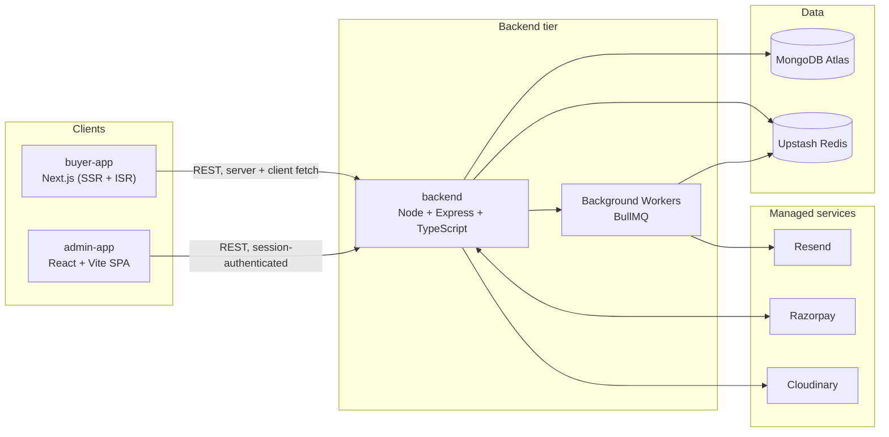

# Architecture

**Project:** TechCart
**Status:** Planned architecture — no application code exists yet (see [Status](#10-status--what-exists-today))
**Related:** [docs/srs/SRS.md](srs/SRS.md) for requirements; "E-Commerce Platform — Technology Blueprint" artifact for the original version-pinned stack rationale; monorepo structure/conventions below were finalized against `github.com/Pravin671231/LeafFlow` as a reference (sibling project, same owner and stack shape).

---

## 1. Overview

TechCart is two client applications sharing one backend and one database — there is no duplicated business logic between apps, and no per-frontend backend.

- **`buyer-app`** — Next.js storefront: catalog browsing, cart, checkout, order history.
- **`admin-app`** — React + Vite console: catalog management, order management, dashboards.
- **`backend`** — Node/Express service both apps call; owns all business logic, validation, and data access.

Target market is India-first (Razorpay), initial scale is small-to-medium, hosting is managed platforms only (Vercel, Render/Railway, MongoDB Atlas, Upstash) — no Docker, no self-managed infrastructure.

---

## 2. Repository Structure

Root-level layout — npm workspaces, flat at repo root (no `apps/` nesting, no shared `packages/`):

```
TechCart/
├── backend/                  # Node 24 + Express 5, TypeScript — owns its own validation schemas
├── buyer-app/                 # Next.js 16 storefront (App Router)
├── admin-app/                  # React 19 + Vite console (SPA)
├── docs/
│   ├── srs/                    # Versioned SRS — see srs/SRS.md
│   └── architecture.md          # this file
├── .github/workflows/ci.yml      # single workflow, checks all three workspaces
├── package.json                  # root, npm workspaces: ["backend", "buyer-app", "admin-app"]
├── tsconfig.base.json
├── eslint.config.ts
├── .prettierrc
├── .nvmrc / .node-version          # "24"
├── CLAUDE.md / AGENTS.md
└── README.md
```

None of this is scaffolded yet — see §10. Internal folder structure for `backend/`, `buyer-app/`, `admin-app/` is deliberately not defined here; it's decided per-feature as each workspace is scaffolded (Foundation phase, then per SRS feature), and each workspace may then keep its own `CLAUDE.md`/`AGENTS.md`/`docs/architecture.md` for implementation-level detail — see §8.

---

## 3. System Diagram



---

## 4. Application Architecture

### 4.1 buyer-app (Next.js)

- App Router; Server Components fetch directly from `backend` for SSR/ISR product and category pages.
- Client Components handle cart, checkout, and account interactivity.
- Rendering strategy by route:

| Route                   | Strategy                           |
| ----------------------- | ---------------------------------- |
| Home, category listing  | ISR (revalidate on catalog change) |
| Product detail          | ISR                                |
| Cart                    | Client-rendered                    |
| Checkout                | Client-rendered, no caching        |
| Account / order history | Client-rendered, session-gated     |

- Client-side data fetching/caching: TanStack Query.
- Cart state: Zustand, persisted to `localStorage` for guests, synced to the backend cart on login.

### 4.2 admin-app (React + Vite)

- SPA with React Router; no SEO requirement, so Vite over a second Next.js instance.
- Every route gated by role claim from the session (`catalog-manager`, `order-manager`, `super-admin`) — checked server-side by `backend` on every request, not just client-side route guards.
- TanStack Query for data fetching/caching, TanStack Table for catalog/order grids, Recharts for dashboard charts.

### 4.3 backend (Node + Express)

Folder/module structure is implementation detail owned by `backend/` itself, not yet locked in as a root-level decision — see `backend/docs/architecture.md` for the current structure and conventions.

- Request validation: Zod schemas defined and used inside `backend` only — there is no shared validation package with the frontends (see §8, "Shared validation").
- Auth: Better Auth mounted as middleware; an RBAC guard middleware checks role claims per route.
- Background workers (BullMQ: order emails, invoice generation, webhook-retry reconciliation) run as a separate long-lived process from the same `backend` codebase, sharing services/repositories — deployed as a second process on Render/Railway, not as a Vercel function.

---

## 5. Data Architecture

High-level collection map (field-level detail belongs in each feature's SRS, not here):

| Collection               | Owned by feature | Notes                                                                                   |
| ------------------------ | ---------------- | --------------------------------------------------------------------------------------- |
| `users`                  | Authentication   | Buyer + Admin accounts, role field for RBAC                                             |
| `products`, `categories` | Product Catalog  | Indexed for Atlas Search                                                                |
| `carts`                  | Shopping Cart    | One per guest session or user                                                           |
| `orders`                 | Orders           | State machine: pending → paid → processing → shipped → delivered / cancelled / refunded |
| `payments`               | Payments         | Razorpay order/payment IDs, webhook event log                                           |

- **Search:** MongoDB Atlas Search index on `products` — no separate search service at current scale.
- **Cache/queues:** Upstash Redis backs both backend response caching (where used) and the BullMQ queues.

---

## 6. Cross-Cutting Concerns

- **Validation** — each workspace validates its own inputs. `backend` is the authority (Zod schemas at the route boundary); `buyer-app`/`admin-app` do their own separate, UX-focused client-side validation. This is an accepted tradeoff (see §8) rather than a gap: it matches the sibling LeafFlow project's convention and keeps the monorepo simpler, at the cost of the two validation layers being able to drift apart — treat `backend`'s validation as the one that actually enforces correctness, and frontend validation as convenience only.
- **Error contract** — every backend error responds with a consistent shape: `{ "success": false, "code": "string", "message": "string" }`, so both frontends handle errors uniformly.
- **Logging** — Pino structured JSON logs from `backend`, shipped to Better Stack/Axiom; no `console.log` in request-handling paths.
- **Error/exception tracking** — Sentry, one project per app (buyer-app, admin-app, backend).
- **Security baseline** — enforced at the backend layer regardless of feature: `helmet`, CORS allowlist (buyer-app + admin-app origins only), Redis-backed rate limiting on auth/checkout/webhook routes, `httpOnly`/`secure`/`sameSite` session cookies. Full detail in SRS v0.8 (Backend NFRs).

---

## 7. Environments

Three separate environments, each with its own MongoDB Atlas cluster and Razorpay key pair (test for dev/staging, live for prod only) — never a shared database across environments.

| Environment | buyer-app      | admin-app                   | backend        | Database                 |
| ----------- | -------------- | --------------------------- | -------------- | ------------------------ |
| Development | local          | local                       | local          | Atlas dev cluster        |
| Staging     | Vercel preview | Render/Railway preview      | Render/Railway | Atlas staging cluster    |
| Production  | Vercel         | Static host (Vercel/Render) | Render/Railway | Atlas production cluster |

---

## 8. Conventions

Formalized against the LeafFlow reference project, with several deliberate simplifications beyond what LeafFlow itself does:

- **Branching** — `feature/<issue-number>-<scope>`, cut from `main`, PR back into `main` directly (no `develop` branch). Branch protection on `main`: PR + CI check required, linear history, squash-merge.
- **Commits** — Conventional Commits, `type(scope): message (Issue #N)`. Types: `feat, fix, test, chore, docs, refactor`. Scopes: `backend, buyer-app, admin-app, ci, infra`. No `Co-Authored-By` trailer.
- **Releases** — on completing a Milestone, tag the repo with a release version marking it. Exact tag naming/versioning scheme is decided during the implementation phase, not fixed here.
- **Testing** — Vitest across all three workspaces; Supertest for backend integration tests; React Testing Library + MSW for both frontends. Backend's specific test-folder conventions are owned by `backend/` itself — see `backend/docs/architecture.md`. Coverage gate: 80% on critical paths (controllers/services/middleware).
- **CI/CD** — a single `.github/workflows/ci.yml` covering lint + test for all three workspaces on PRs into `main`. Exact triggers/jobs/matrix are a Foundation-phase decision.
- **Shared validation** — deliberately **not** shared (see §6). No `packages/` directory exists in this repo at all.
- **Node pinning** — `.nvmrc` + `.node-version`, both `"24"`, plus root `package.json` `"engines": { "node": ">=24" }`.
- **Docs** — `docs/milestone.md` is the milestone-level roadmap (M0–M10); `docs/issues.md` is where issues are drafted (context, task checklist, test criteria) before being opened on GitHub, extended one milestone at a time as each feature's SRS doc is written; `docs/srs/SRS.md`'s §6 Traceability Matrix is the source of truth for the live feature↔milestone↔issue links once issues are actually open.
- **Next.js version guard** — `buyer-app` gets its own `AGENTS.md` (a short warning that Next.js 16 has breaking changes from training-data-era APIs, read `node_modules/next/dist/docs/` first) with `buyer-app/CLAUDE.md` as a one-line `@AGENTS.md` import — created when `buyer-app/` is scaffolded, not now.
- **Workspace-level documentation** — each of `backend/`, `buyer-app/`, `admin-app/` may keep its own `CLAUDE.md`, `AGENTS.md`, and `docs/architecture.md`, created when that workspace is scaffolded. Root-level docs (this file included) stay the source of truth for repo-wide architecture decisions and conventions; workspace-level docs cover only that app's own implementation details, guidelines, and development practices — they don't restate or override root-level decisions.

---

## 9. Architecture Decisions

Short rationale for choices that could reasonably have gone another way.

| Decision           | Chosen                                             | Instead of                          | Why                                                                                                                                                                                                |
| ------------------ | -------------------------------------------------- | ----------------------------------- | -------------------------------------------------------------------------------------------------------------------------------------------------------------------------------------------------- |
| Backend shape      | One shared Express service (`backend/`)            | Next.js API routes as backend       | `admin-app` isn't Next.js — API routes would only serve `buyer-app`, forcing duplicated logic for `admin-app`.                                                                                     |
| Auth               | Better Auth                                        | Auth.js / Clerk                     | Auth.js went maintenance-only in 2026; Better Auth is self-hosted (no per-MAU cost) with built-in RBAC, which `admin-app` needs.                                                                   |
| Catalog search     | MongoDB Atlas Search                               | Algolia                             | No extra infra/vendor cost at current scale; revisit past ~50k SKUs.                                                                                                                               |
| Buyer client state | Zustand + TanStack Query                           | Redux Toolkit                       | Not enough cross-cutting client state to justify Redux's ceremony.                                                                                                                                 |
| Monorepo tooling   | npm workspaces, flat `backend/buyer-app/admin-app` | pnpm + Turborepo, nested `apps/*`   | Matches the sibling LeafFlow project exactly; simpler for the current scale, and LeafFlow's existing `tdd-workflow` automation already assumes npm workspace commands.                             |
| Shared validation  | None — schemas live in `backend` only              | A shared `packages/schemas` package | Matches LeafFlow; keeps the repo to three workspaces with no shared-package build-order complexity. Accepted tradeoff: frontend/backend validation can drift since they're separate code (see §6). |

Open items not yet decided (tracked in SRS, revisit when the trigger condition is hit): TypeScript 6 vs. 7 adoption, Express vs. Fastify if profiling shows the backend as the bottleneck, single vs. multi payment gateway if selling outside India, Git tag/versioning scheme for releases.

---

## 10. Status — what exists today

As of 2026-07-22: `docs/srs/SRS.md`, `docs/milestone.md`, this file, `README.md`, `.gitignore`, root `CLAUDE.md`/`AGENTS.md`, plus the M0.1 root workspace scaffolding (Issue #1, merged): `package.json` (npm workspaces), `tsconfig.base.json`, `eslint.config.ts`, `.prettierrc`, `.nvmrc`/`.node-version`. `backend/` is scaffolded (Issue #2 / M0.2, merged) — Express 5 + TypeScript, module-based structure, `health` module, error contract, Vitest+Supertest; coverage reporting is wired (Issue #3 / M0.3, merged); see `backend/docs/architecture.md` for its current structure (implementation detail, not a root-level decision). `buyer-app/` is scaffolded (Issue #4 / M0.4, merged) — Next.js 16 App Router, Tailwind CSS 4, feature-based structure, a placeholder home route; a Vitest + React Testing Library + MSW test suite is wired (Issue #5 / M0.5, merged); see `buyer-app/docs/architecture.md` for its current structure. `admin-app/` is scaffolded (Issue #6 / M0.6, merged) — Vite + React 19 + TypeScript, React Router, Tailwind CSS 4, feature-based structure, a placeholder landing route; a Vitest + React Testing Library + MSW test suite is wired (Issue #7 / M0.7, merged); see `admin-app/docs/architecture.md` for its current structure. Root fan-out scripts (`npm run build`, `npm run lint`, `npm test`, plus `test:backend`/`test:buyer-app`/`test:admin-app`) are wired (Issue #8 / M0.8, merged), verified against a genuinely clean clone — `npm install && npm run build && npm test` all succeed with no manual intervention, matching M0's exit criteria exactly. **M0 (Foundation) is complete.** M1 (CI Pipeline) is in progress: `.github/workflows/ci.yml` (Issue #9 / M1.1, merged) runs a `lint` job plus a `[backend, buyer-app, admin-app]` test matrix (`fail-fast: false`) on every PR into `main` — verified live before merge via temporary commits: a broken test failed only its own matrix leg, and a lint violation failed only the `lint` job, both reverted cleanly before the final merge. **M1 is not yet complete** — Issue #10 (M1.2, branch protection on `main` requiring the CI check and enforcing linear history/squash-merge) is still open, so the CI check is currently advisory only, not load-bearing. The structure in §2 and conventions in §8 remain the target for the rest of M1 and beyond.
