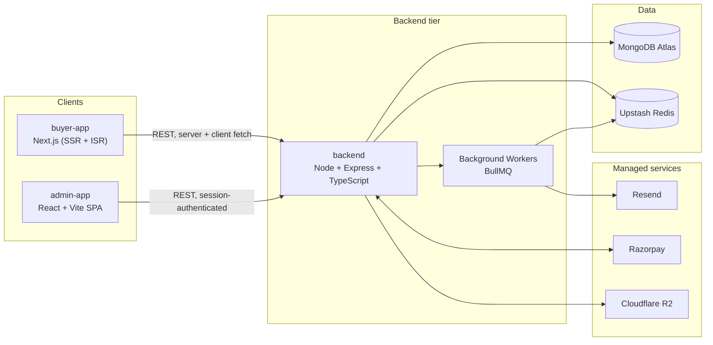

# Architecture

**Project:** TechCart
**Status:** Planned architecture — no application code exists yet (see [Status](#10-status--what-exists-today))
**Related:** [docs/srs/SRS.md](srs/SRS.md) for requirements; "E-Commerce Platform — Technology Blueprint" artifact for the original version-pinned stack rationale; monorepo structure/conventions below were finalized against `github.com/Pravin671231/LeafFlow` as a reference (sibling project, same owner and stack shape).

---

## 1. Overview

TechCart is two client applications sharing one backend and one database — there is no duplicated business logic between apps, and no per-frontend backend.

- **`buyer-app`** — Next.js storefront: catalog browsing, cart, checkout, order history.
- **`admin-app`** — React + Vite console: catalog management, order management, dashboards.
- **`backend`** — Node/Express service both apps call; owns all business logic, validation, and data access.

Target market is India-first (Razorpay), initial scale is small-to-medium, hosting is managed platforms only (Vercel, Render, MongoDB Atlas, Upstash) — `backend` deploys from a Dockerfile on Render, `buyer-app` and `admin-app` are both Vercel-native; no self-managed infrastructure either way. See `docker/` at the repo root.

---

## 2. Repository Structure

Root-level layout — npm workspaces, flat at repo root (no `apps/` nesting, no shared `packages/`):

```
TechCart/
├── backend/                  # Node 24 + Express 5, TypeScript — owns its own validation schemas
├── buyer-app/                 # Next.js 16 storefront (App Router)
├── admin-app/                  # React 19 + Vite console (SPA)
├── docs/
│   ├── srs/                    # Versioned SRS — see srs/SRS.md
│   └── architecture.md          # this file
├── mock-ui/                     # static layout wireframes (not a workspace)
├── .github/workflows/ci.yml      # single workflow, checks all three workspaces
├── package.json                  # root, npm workspaces: ["backend", "buyer-app", "admin-app"]
├── tsconfig.base.json
├── eslint.config.ts
├── .prettierrc
├── .nvmrc / .node-version          # "24"
├── CLAUDE.md / AGENTS.md
└── README.md
```

None of this is scaffolded yet — see §10. Internal folder structure for `backend/`, `buyer-app/`, `admin-app/` is deliberately not defined here; it's decided per-feature as each workspace is scaffolded (Foundation phase, then per SRS feature), and each workspace may then keep its own `CLAUDE.md`/`AGENTS.md`/`docs/architecture.md` for implementation-level detail — see §8.

---

## 3. System Diagram


```mermaid
flowchart LR
    subgraph Clients
        Buyer["buyer-app\nNext.js (SSR + ISR)"]
        Admin["admin-app\nReact + Vite SPA"]
    end
    subgraph Backend tier
        Backend["backend\nNode + Express + TypeScript"]
        Worker["Background Workers\nBullMQ"]
    end
    subgraph Data
        Mongo[("MongoDB Atlas")]
        Redis[("Upstash Redis")]
    end
    subgraph Managed services
        Razorpay["Razorpay"]
        R2["Cloudflare R2"]
        Resend["Resend"]
    end

    Buyer -->|REST, server + client fetch| Backend
    Admin -->|REST, session-authenticated| Backend
    Backend --> Mongo
    Backend --> Redis
    Backend --> Worker
    Worker --> Redis
    Backend <--> Razorpay
    Backend --> R2
    Worker --> Resend
```

---

## 4. Application Architecture

### 4.1 buyer-app (Next.js)

- App Router; Server Components fetch directly from `backend` for SSR/ISR product and category pages.
- Client Components handle cart, checkout, and account interactivity.
- Rendering strategy by route:

| Route                   | Strategy                           |
| ----------------------- | ---------------------------------- |
| Home, category listing  | ISR (revalidate on catalog change) |
| Product detail          | ISR                                |
| Cart                    | Client-rendered                    |
| Checkout                | Client-rendered, no caching        |
| Account / order history | Client-rendered, session-gated     |

- Client-side data fetching/caching: Redux Toolkit + RTK Query (Issue #71 / M2.14, superseding an earlier TanStack Query plan) — `createApi`'s cache tags give the catalog's filtered/paginated listing screens (M2.16/M2.17) automatic refetch-on-arg-change with no manual `useEffect` wiring. See `buyer-app/docs/architecture.md`'s "State management / data fetching" section for the implementation.
- Cart state: Zustand, persisted to `localStorage` for guests, synced to the backend cart on login.

### 4.2 admin-app (React + Vite)

- SPA with React Router; no SEO requirement, so Vite over a second Next.js instance.
- Every route gated by role claim from the session (`catalog-manager`, `order-manager`, `super-admin`) — checked server-side by `backend` on every request, not just client-side route guards.
- TanStack Query for data fetching/caching, TanStack Table for catalog/order grids, Recharts for dashboard charts.

### 4.3 backend (Node + Express)

Folder/module structure is implementation detail owned by `backend/` itself, not yet locked in as a root-level decision — see `backend/docs/architecture.md` for the current structure and conventions.

- Request validation: Zod schemas defined and used inside `backend` only — there is no shared validation package with the frontends (see §8, "Shared validation").
- Auth: Better Auth mounted as middleware; an RBAC guard middleware checks role claims per route.
- Background workers (BullMQ: order emails, invoice generation, webhook-retry reconciliation) run as a separate long-lived process from the same `backend` codebase, sharing services/repositories — deployed as a second process on Render/Railway, not as a Vercel function.

---

## 5. Data Architecture

High-level collection map (field-level detail belongs in each feature's SRS, not here):

| Collection                                   | Owned by feature | Notes                                                                                       |
| -------------------------------------------- | ---------------- | ------------------------------------------------------------------------------------------- |
| `users`                                      | Authentication   | Buyer + Admin accounts, role field for RBAC                                                 |
| `products`, `categories`                     | Product Catalog  | Indexed for Atlas Search; product variants are embedded on `products`, not a collection     |
| `brands`                                     | Product Catalog  | Required reference on every product; backs the buyer brand filter                           |
| `categorySpecifications`, `categoryVariants` | Product Catalog  | One document per category each — the spec schema and variant axes a category's products use |
| `carts`                                      | Shopping Cart    | One per guest session or user                                                               |
| `orders`                                     | Orders           | State machine: pending → paid → processing → shipped → delivered / cancelled / refunded     |
| `payments`                                   | Payments         | Razorpay order/payment IDs, webhook event log                                               |

- **Search:** MongoDB Atlas Search index on `products` — no separate search service at current scale.
- **Object storage:** Cloudflare R2 (S3-compatible) for product, brand, and category images, via presigned direct upload — the backend never handles image bytes. See SRS v0.2 §2.12.
- **Cache/queues:** Upstash Redis backs both backend response caching (where used) and the BullMQ queues.

---

## 6. Cross-Cutting Concerns

- **Validation** — each workspace validates its own inputs. `backend` is the authority (Zod schemas at the route boundary); `buyer-app`/`admin-app` do their own separate, UX-focused client-side validation. This is an accepted tradeoff (see §8) rather than a gap: it matches the sibling LeafFlow project's convention and keeps the monorepo simpler, at the cost of the two validation layers being able to drift apart — treat `backend`'s validation as the one that actually enforces correctness, and frontend validation as convenience only.
- **Error contract** — every backend error responds with a consistent shape: `{ "success": false, "code": "string", "message": "string" }`, so both frontends handle errors uniformly.
- **Logging** — Pino structured JSON logs from `backend`, shipped to Better Stack/Axiom; no `console.log` in request-handling paths.
- **Error/exception tracking** — Sentry, one project per app (buyer-app, admin-app, backend).
- **Security baseline** — enforced at the backend layer regardless of feature: `helmet`, CORS allowlist (buyer-app + admin-app origins only), Redis-backed rate limiting on auth/checkout/webhook routes, `httpOnly`/`secure`/`sameSite` session cookies. Full detail in SRS v0.8 (Backend NFRs). The CORS allowlist piece was implemented ahead of the rest of this bundle (`backend/src/middleware/cors.ts`, env-driven via `CORS_ORIGINS` — see `backend/CLAUDE.md`), once `buyer-app`/`admin-app` started deploying to origins separate from `backend`; `helmet`, rate limiting, and session cookies remain deferred to v0.8.

---

## 7. Environments

Three separate environments, each with its own MongoDB Atlas cluster and Razorpay key pair (test for dev/staging, live for prod only) — never a shared database across environments.

| Environment | buyer-app      | admin-app      | backend | Database                 |
| ----------- | -------------- | -------------- | ------- | ------------------------ |
| Development | local          | local          | local   | Atlas dev cluster        |
| Staging     | Vercel preview | Vercel preview | Render  | Atlas staging cluster    |
| Production  | Vercel         | Vercel         | Render  | Atlas production cluster |

`backend` builds from `docker/Dockerfile.backend` wherever it lands on Render (see root `render.yaml`); `buyer-app` and `admin-app` are both Vercel-native and never build from a Dockerfile in any real environment — their own Dockerfiles exist solely for `docker-compose` local-dev parity with `backend` (root `docker-compose.yml`).

---

## 8. Conventions

Formalized against the LeafFlow reference project, with several deliberate simplifications beyond what LeafFlow itself does:

- **Branching** — `feature/<issue-number>-<scope>`, cut from `main`, PR back into `main` directly (no `develop` branch). Branch protection on `main` is configured (Issue #10 / M1.2): PR required (0 approvals — solo-maintained repo), the `lint` + 3-way `test` CI checks required, `enforce_admins` on, linear history, squash-merge only (repo only allows squash; merge-commit and rebase-merge are disabled). Direct pushes to `main`, including doc-sync commits, are rejected — everything goes through a PR.
- **Commits** — Conventional Commits, `type(scope): message (Issue #N)`. Types: `feat, fix, test, chore, docs, refactor`. Scopes: `backend, buyer-app, admin-app, ci, infra`. No `Co-Authored-By` trailer.
- **Releases** — annotated git tags `vX.Y.0` on `main`, published as GitHub Releases. Tag versions follow the SRS version they realize: once every milestone mapping to a given SRS version (per `docs/milestone.md`'s "Maps to" column) is complete, that SRS version gets its `vX.Y.0` tag; patch versions are reserved for interim fixes between milestones. `v0.1.0` marks M0 (Foundation) + M1 (CI Pipeline) — the infra groundwork for SRS v0.1 — both complete.
- **Testing** — Vitest across all three workspaces; Supertest for backend integration tests; React Testing Library + MSW for both frontends. Backend's specific test-folder conventions are owned by `backend/` itself — see `backend/docs/architecture.md`. Coverage gate: 80% on critical paths (controllers/services/middleware).
- **CI/CD** — a single `.github/workflows/ci.yml` covering lint + test for all three workspaces on PRs into `main`. Exact triggers/jobs/matrix are a Foundation-phase decision.
- **Shared validation** — deliberately **not** shared (see §6). No `packages/` directory exists in this repo at all.
- **Node pinning** — `.nvmrc` + `.node-version`, both `"24"`, plus root `package.json` `"engines": { "node": ">=24" }`.
- **Docs** — `docs/milestone.md` is the milestone-level roadmap (M0–M10); `docs/issues.md` is where issues are drafted (context, task checklist, test criteria) before being opened on GitHub, extended one milestone at a time as each feature's SRS doc is written; `docs/srs/SRS.md`'s §6 Traceability Matrix is the source of truth for the live feature↔milestone↔issue links once issues are actually open.
- **Next.js version guard** — `buyer-app` gets its own `AGENTS.md` (a short warning that Next.js 16 has breaking changes from training-data-era APIs, read `node_modules/next/dist/docs/` first) with `buyer-app/CLAUDE.md` as a one-line `@AGENTS.md` import — created when `buyer-app/` is scaffolded, not now.
- **Workspace-level documentation** — each of `backend/`, `buyer-app/`, `admin-app/` may keep its own `CLAUDE.md`, `AGENTS.md`, and `docs/architecture.md`, created when that workspace is scaffolded. Root-level docs (this file included) stay the source of truth for repo-wide architecture decisions and conventions; workspace-level docs cover only that app's own implementation details, guidelines, and development practices — they don't restate or override root-level decisions.

---

## 9. Architecture Decisions

Short rationale for choices that could reasonably have gone another way.

| Decision           | Chosen                                                                    | Instead of                                              | Why                                                                                                                                                                                                                                           |
| ------------------ | ------------------------------------------------------------------------- | ------------------------------------------------------- | --------------------------------------------------------------------------------------------------------------------------------------------------------------------------------------------------------------------------------------------- |
| Backend shape      | One shared Express service (`backend/`)                                   | Next.js API routes as backend                           | `admin-app` isn't Next.js — API routes would only serve `buyer-app`, forcing duplicated logic for `admin-app`.                                                                                                                                |
| Auth               | Better Auth                                                               | Auth.js / Clerk                                         | Auth.js went maintenance-only in 2026; Better Auth is self-hosted (no per-MAU cost) with built-in RBAC, which `admin-app` needs.                                                                                                              |
| Catalog search     | MongoDB Atlas Search                                                      | Algolia                                                 | No extra infra/vendor cost at current scale; revisit past ~50k SKUs.                                                                                                                                                                          |
| Buyer client state | Zustand (cart) + Redux Toolkit/RTK Query (server data, Issue #71 / M2.14) | Zustand + TanStack Query for everything                 | RTK Query's cache tags (`tagTypes: ["Product", "Category"]`) give the catalog's filtered/paginated listing screens automatic refetch-on-arg-change with no manual `useEffect` wiring; cart state stays on Zustand, unaffected by this change. |
| Monorepo tooling   | npm workspaces, flat `backend/buyer-app/admin-app`                        | pnpm + Turborepo, nested `apps/*`                       | Matches the sibling LeafFlow project exactly; simpler for the current scale, and LeafFlow's existing `tdd-workflow` automation already assumes npm workspace commands.                                                                        |
| Shared validation  | None — schemas live in `backend` only                                     | A shared `packages/schemas` package                     | Matches LeafFlow; keeps the repo to three workspaces with no shared-package build-order complexity. Accepted tradeoff: frontend/backend validation can drift since they're separate code (see §6).                                            |
| Release versioning | Git tags `vX.Y.0` mirror the SRS version they realize (see §8, Releases)  | Independent semver track, or a tag per GitHub Milestone | Keeps one version number instead of two parallel ones (SRS doc version vs. release tag); `package.json` versions across all four workspaces already matched `0.1.0` when this was decided, needing no bump.                                   |

Open items not yet decided (tracked in SRS, revisit when the trigger condition is hit): TypeScript 6 vs. 7 adoption, Express vs. Fastify if profiling shows the backend as the bottleneck, single vs. multi payment gateway if selling outside India.

---

## 10. Status — what exists today

As of 2026-07-29: `docs/srs/SRS.md`, `docs/milestone.md`, this file, `README.md`, `.gitignore`, root `CLAUDE.md`/`AGENTS.md`, plus the M0.1 root workspace scaffolding (Issue #1, merged): `package.json` (npm workspaces), `tsconfig.base.json`, `eslint.config.ts`, `.prettierrc`, `.nvmrc`/`.node-version`. `backend/` is scaffolded (Issue #2 / M0.2, merged) — Express 5 + TypeScript, module-based structure, `health` module, error contract, Vitest+Supertest; coverage reporting is wired (Issue #3 / M0.3, merged); see `backend/docs/architecture.md` for its current structure (implementation detail, not a root-level decision). `buyer-app/` is scaffolded (Issue #4 / M0.4, merged) — Next.js 16 App Router, Tailwind CSS 4, feature-based structure, a placeholder home route; a Vitest + React Testing Library + MSW test suite is wired (Issue #5 / M0.5, merged); see `buyer-app/docs/architecture.md` for its current structure. `admin-app/` is scaffolded (Issue #6 / M0.6, merged) — Vite + React 19 + TypeScript, React Router, Tailwind CSS 4, feature-based structure, a placeholder landing route; a Vitest + React Testing Library + MSW test suite is wired (Issue #7 / M0.7, merged); see `admin-app/docs/architecture.md` for its current structure. Root fan-out scripts (`npm run build`, `npm run lint`, `npm test`, plus `test:backend`/`test:buyer-app`/`test:admin-app`) are wired (Issue #8 / M0.8, merged), verified against a genuinely clean clone — `npm install && npm run build && npm test` all succeed with no manual intervention, matching M0's exit criteria exactly. **M0 (Foundation) is complete.** M1 (CI Pipeline) is in progress: `.github/workflows/ci.yml` (Issue #9 / M1.1, merged) runs a `lint` job plus a `[backend, buyer-app, admin-app]` test matrix (`fail-fast: false`) on every PR into `main` — verified live before merge via temporary commits: a broken test failed only its own matrix leg, and a lint violation failed only the `lint` job, both reverted cleanly before the final merge. Branch protection on `main` is now configured (Issue #10 / M1.2, merged) — PR + passing CI required, `enforce_admins` on, linear history, squash-merge only; verified live (direct push rejected, a failing check blocked merge, merge-commit/rebase-merge both rejected). **M1 (CI Pipeline) is complete.**

SRS v0.2 (Product Catalog) is spec-drafted (PR #23, merged): `docs/srs/features/0.2-product-catalog.md` covers `FR-CAT-001`–`096` across all 10 template sections in `docs/srs/SRS.md` §4's format — product/category/brand CRUD, category-governed specifications and variant types, embedded sellable product variants, Cloudflare R2 image uploads, integer-paise pricing, a temporary admin shared-secret guard ahead of v0.3 Authentication, and a `{ success, data }` response envelope with buyer-facing `availability` status in place of raw stock counts. Its backend implementation is broken into 12 issues, drafted with full Context/Tasks/Test Criteria in `docs/issues.md` under **Backlog → M2**, and opened as GitHub Issues #25–#36 (PR #37) — every `FR-CAT` requirement assigned to exactly one issue. `buyer-app`/`admin-app` screen implementation for M2 is deliberately not drafted, pending the SRS's own open question on screen-level UI design; a throwaway `mock-ui/` prototype (static HTML, not a workspace) exists as a visual reference in the meantime. The structure in §2 and conventions in §8 remain the target for M2 implementation.

M2 implementation is underway. Issue #25 / M2.1 (core plumbing, merged) replaces `backend/src/config/db.ts`'s stub with a live Mongoose connection, adds a `zod`-validated `src/config/env.ts`, a shared `{ success, data }` response envelope (`src/utils/apiResponse.ts`), and a temporary `X-Admin-Key` shared-secret guard (`src/middleware/adminAuth.ts`) gating everything mounted under `/api/admin` (`FR-CAT-088`–`090`) ahead of real session/RBAC auth in v0.3. Issue #26 / M2.2 (Cloudflare R2 image uploads, merged) adds `backend/src/externalService/r2.ts` — the first external-service client — and the `uploads` module: a presigned direct-to-R2 upload path (`POST /api/admin/uploads/presign`, `FR-CAT-077`–`084`) plus a backend-proxied `multipart/form-data` upload path (`POST /api/admin/uploads/direct`, SRS amendment `FR-CAT-097`–`100`) for clients that can't perform a direct browser-to-R2 `PUT`. Issue #27 / M2.3 (brand management, merged) adds `backend/src/modules/brands/` — the first DB-backed catalog-entity module, populating the `brands` collection from §5 — with admin create/update/list-with-product-count/get/guarded-delete endpoints plus a public active-only `GET /api/brands` (`FR-CAT-023`–`029`). It also introduces two reusable pieces later catalog modules build on: a shared slug-generation utility (`backend/src/utils/slug.ts`) and a minimal `products` collection stub (just enough to back the brand delete guard and product-count aggregation ahead of the real product module, #31). Issue #28 / M2.4 (category management, merged) adds `backend/src/modules/categories/` — populating the `categories` collection from §5 — with admin create/update/list-with-product-count/get/guarded-delete endpoints plus a public active-only `GET /api/categories` (`FR-CAT-014`–`022`). Categories are at most two levels deep (`parentCategory`, validated on both create and update); deleting one requires zero direct products **and** zero subcategories. The `products` stub grows a `category` field alongside `brand`, and two more reusable pieces land: `backend/src/utils/objectId.ts` (`:id` validation, promoted out of the brands module) and `backend/src/utils/text.ts` (SEO meta-description truncation). Issue #29 / M2.5 (category-governed specifications, merged) adds `backend/src/modules/categorySpecifications/` — populating the `categorySpecifications` collection from §5, one document per category — with `GET`/`PUT`/`PATCH` endpoints only (`FR-CAT-030`–`035`); deleting a specification group or field is rejected if any product references it, naming the blocking field(s) and count. Deleting a category now also deletes its specification document (`FR-CAT-019`'s cascade, previously deferred). Issue #30 / M2.6 (category-governed variant types, merged) adds `backend/src/modules/categoryVariants/` — populating the `categoryVariants` collection from §5, one document per category — with the identical `GET`/`PUT`/`PATCH`-only shape (`FR-CAT-036`–`038`); unlike specifications, deleting a variant axis carries **no in-use guard at all**, since the definition drives admin form rendering only and is never enforced against stored variant attributes. Deleting a category now also deletes its variant-type document, completing `FR-CAT-019`'s cascade. Issue #31 / M2.7 (product core CRUD and pricing, merged) graduates `backend/src/modules/products/` from a stub to a full module, populating the `products` collection from §5 — admin create/update/get/paginated-list/soft-delete endpoints plus a dedicated `PATCH .../stock` path (`FR-CAT-001`–`013`), with `sellingPrice` computed server-side on every write via a new shared `backend/src/utils/pricing.ts` (`FR-CAT-085`–`087`, reused by variants in #32). SKU uniqueness (`FR-CAT-003`) spans both `products.sku` and the embedded `products.variants.sku`, enforced by two indexes plus an application-level cross-check. Issue #32 / M2.8 (product variants, merged) fills in the `variants` subdocument that index anticipated — `attributes`, `images`, `mrp`/`discount`/`sellingPrice`, `stock`, `weight`, `active` (`FR-CAT-039`–`044`) — with `POST`/`PATCH /api/admin/products/:id/variants[/:variantId]` added to the same module. No two variants of one product may share an attribute-pair set, active or inactive (`FR-CAT-041`); deactivation is `active: false`, never a hard removal (`FR-CAT-040`). Issue #33 / M2.9 (status update APIs, merged) adds a dedicated `PATCH .../status` to all three entities that had been deferring one: `PATCH /api/admin/products/:id/status` (`FR-CAT-045`, tri-state `draft`/`published`/`archived`) and `PATCH /api/admin/categories/:id/status` / `PATCH /api/admin/brands/:id/status` (`FR-CAT-046`–`047`, boolean toggles). Deactivating never touches either entity's own delete guard (`FR-CAT-048`) — deactivating and deleting remain independent operations. Issue #34 / M2.10 (admin search, merged) adds a `search` query param to `GET /api/admin/products`/`categories`/`brands` (`FR-CAT-050`–`052`, a plain case-insensitive MongoDB regex on `name`, plus an exact-or-prefix match on `sku` for products) and a `status` query param on the product grid, composing independently with `search` (`FR-CAT-053`). Issue #35 / M2.11 (buyer browsing, merged) adds the first buyer-facing product endpoints — `GET /api/products` (paginated, `published`-only, `?q=` MongoDB Atlas Search), `GET /api/products/:slug`, `GET /api/categories/:slug/products`, and `GET /api/categories/search` (`FR-CAT-054`–`067`, `095`–`096`) — deriving a buyer-facing `availability` enum in place of raw stock counts; the Atlas Search index still needs provisioning against a real Atlas cluster. Issue #36 / M2.12 (buyer filtering, sorting, and card content, merged) extends the two buyer listing endpoints with price/brand/category/variant-attribute/filterable-specification/in-stock/on-sale filters and a `sort` option, all composable together (`FR-CAT-068`–`076`), plus `cardSpecifications` — a category's first four `filterable` specification fields, in schema declaration order — on every list item (`FR-CAT-091`–`092`). **M2 (Product Catalog) is complete** — Issues #25 through #36 are all merged. See `backend/docs/architecture.md` for full implementation detail.

Frontend build-out for M2 is drafted in `docs/issues.md` (PR #70), covering `buyer-app`/`admin-app` screen work deferred at spec time. Issue #76 / M2.19 (admin-app: Redux Toolkit store, RTK Query API setup & X-Admin-Key auth, merged) gives `admin-app/` its first state-management/HTTP layer: `src/store/authSlice.ts` (a `sessionStorage`-backed `adminKey`), `src/store/api.ts` (an RTK Query `createApi` instance whose `fetchBaseQuery` is scoped to `/api/admin`, attaches `X-Admin-Key` when a key is present, and clears it on a `401`), and `src/store/store.ts` (`configureStore` + a `createStore()` factory for isolated test stores) — plus a throwaway `src/features/adminKey/` prompt gating all routes until a key is entered, since the key can't be hardcoded or committed and real sessions replace this outright in v0.3. See `admin-app/docs/architecture.md` for full implementation detail. Issue #77 / M2.20 (admin-app: brand management, merged) adds `src/features/brands/` — the first real RTK Query mutation consumer of that store — `getBrands`/`createBrand`/`updateBrand`/`updateBrandStatus`/`deleteBrand`, all sharing one flat `"Brand"` cache tag, backing a list view (logo, product count, status), a create/edit form, an inline `409 BRAND_IN_USE` delete-guard rejection, and a status toggle kept on the list rather than the form (`backend`'s `PATCH .../:id` doesn't accept `status`; only the dedicated `PATCH .../:id/status` does). Also adds `src/features/uploads/uploadsApi.ts` — a feature-agnostic presign-then-PUT-to-R2 flow (`presignUpload` + `putFileToPresignedUrl`), used here for brand logos and reusable as-is for category/product images in later issues. See `admin-app/docs/architecture.md` for full implementation detail. Issue #71 / M2.14 (buyer-app: Redux Toolkit store & RTK Query API setup, merged) gives `buyer-app/` its own first state-management/HTTP layer: `src/store/api.ts`'s `createApi` instance wraps `fetchBaseQuery` in a custom `baseQuery` that unwraps `backend`'s `{ success, data }` envelope down to `data` and normalizes both of its error shapes (`{code,message}` and the `ZodError`-only `{code,errors}` shape) into one consistent `{ code, message }`, with `tagTypes: ["Product", "Category"]` declared for later cache invalidation but zero endpoints defined yet — those land per-feature via `api.injectEndpoints({...})` starting M2.15. `src/store/store.ts`/`StoreProvider.tsx` create the Redux store once per `StoreProvider` instance (not a module singleton), mounted into the App Router via a `"use client"` boundary that keeps `layout.tsx` itself a Server Component. `src/store/env.ts` validates `NEXT_PUBLIC_API_URL` with `zod` at import time, failing `next build`/`next dev` loudly if it's unset rather than silently defaulting. This also corrects this file's own §4.1 and §8 decision table, which previously named TanStack Query for buyer-app's client-side data fetching. See `buyer-app/docs/architecture.md` for full implementation detail. Issue #72 / M2.15 (buyer-app: home / all-products listing, merged) replaces `HomePlaceholder` with the first real screen and adds `src/features/products/` — the shared, cross-screen product-listing feature (`ProductCard`, `ProductGrid`, `Pagination`, `SortSelect`, loading/empty/error states, and a `getProducts` endpoint) that M2.16 (category listing) and M2.17 (search results) reuse rather than duplicate; also resolves the `pagination`-via-`meta` TODO #71 left in `src/store/api.ts`. See `buyer-app/docs/architecture.md` for full implementation detail.
