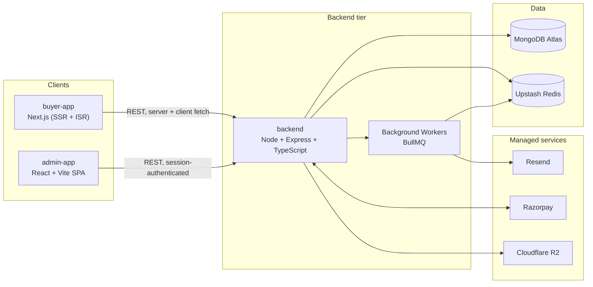

# Architecture

**Project:** TechCart
**Status:** Planned architecture — no application code exists yet (see [Status](#10-status--what-exists-today))
**Related:** [docs/srs/SRS.md](srs/SRS.md) for requirements; "E-Commerce Platform — Technology Blueprint" artifact for the original version-pinned stack rationale; monorepo structure/conventions below were finalized against `github.com/Pravin671231/LeafFlow` as a reference (sibling project, same owner and stack shape).

---

## 1. Overview

TechCart is two client applications sharing one backend and one database — there is no duplicated business logic between apps, and no per-frontend backend.

- **`buyer-app`** — Next.js storefront: catalog browsing, cart, checkout, order history.
- **`admin-app`** — React + Vite console: catalog management, order management, dashboards.
- **`backend`** — Node/Express service both apps call; owns all business logic, validation, and data access.

Target market is India-first (Razorpay), initial scale is small-to-medium, hosting is managed platforms only (Vercel, Render, MongoDB Atlas, Upstash) — `backend` deploys from a Dockerfile on Render, `buyer-app` and `admin-app` are both Vercel-native; no self-managed infrastructure either way. See `docker/` at the repo root.

---

## 2. Repository Structure

Root-level layout — npm workspaces, flat at repo root (no `apps/` nesting, no shared `packages/`):

```
TechCart/
├── backend/                  # Node 24 + Express 5, TypeScript — owns its own validation schemas
├── buyer-app/                 # Next.js 16 storefront (App Router)
├── admin-app/                  # React 19 + Vite console (SPA)
├── docs/
│   ├── srs/                    # Versioned SRS — see srs/SRS.md
│   └── architecture.md          # this file
├── mock-ui/                     # static layout wireframes (not a workspace)
├── .github/workflows/ci.yml      # single workflow, checks all three workspaces
├── package.json                  # root, npm workspaces: ["backend", "buyer-app", "admin-app"]
├── tsconfig.base.json
├── eslint.config.ts
├── .prettierrc
├── .nvmrc / .node-version          # "24"
├── CLAUDE.md / AGENTS.md
└── README.md
```

None of this is scaffolded yet — see §10. Internal folder structure for `backend/`, `buyer-app/`, `admin-app/` is deliberately not defined here; it's decided per-feature as each workspace is scaffolded (Foundation phase, then per SRS feature), and each workspace may then keep its own `CLAUDE.md`/`AGENTS.md`/`docs/architecture.md` for implementation-level detail — see §8.

---

## 3. System Diagram


```mermaid
flowchart LR
    subgraph Clients
        Buyer["buyer-app\nNext.js (SSR + ISR)"]
        Admin["admin-app\nReact + Vite SPA"]
    end
    subgraph Backend tier
        Backend["backend\nNode + Express + TypeScript"]
        Worker["Background Workers\nBullMQ"]
    end
    subgraph Data
        Mongo[("MongoDB Atlas")]
        Redis[("Upstash Redis")]
    end
    subgraph Managed services
        Razorpay["Razorpay"]
        R2["Cloudflare R2"]
        Resend["Resend"]
    end

    Buyer -->|REST, server + client fetch| Backend
    Admin -->|REST, session-authenticated| Backend
    Backend --> Mongo
    Backend --> Redis
    Backend --> Worker
    Worker --> Redis
    Backend <--> Razorpay
    Backend --> R2
    Worker --> Resend
```

---

## 4. Application Architecture

### 4.1 buyer-app (Next.js)

- App Router; Server Components fetch directly from `backend` for SSR/ISR product and category pages.
- Client Components handle cart, checkout, and account interactivity.
- Rendering strategy by route:

| Route                   | Strategy                           |
| ----------------------- | ---------------------------------- |
| Home, category listing  | ISR (revalidate on catalog change) |
| Product detail          | ISR                                |
| Cart                    | Client-rendered                    |
| Checkout                | Client-rendered, no caching        |
| Account / order history | Client-rendered, session-gated     |

- Client-side data fetching/caching: Redux Toolkit + RTK Query (Issue #71 / M2.14, superseding an earlier TanStack Query plan) — `createApi`'s cache tags give the catalog's filtered/paginated listing screens (M2.16/M2.17) automatic refetch-on-arg-change with no manual `useEffect` wiring. See `buyer-app/docs/architecture.md`'s "State management / data fetching" section for the implementation.
- Cart state: Zustand, persisted to `localStorage` for guests, synced to the backend cart on login.

### 4.2 admin-app (React + Vite)

- SPA with React Router; no SEO requirement, so Vite over a second Next.js instance.
- Every route gated by role claim from the session (`catalog-manager`, `order-manager`, `super-admin`) — checked server-side by `backend` on every request, not just client-side route guards.
- TanStack Query for data fetching/caching, TanStack Table for catalog/order grids, Recharts for dashboard charts.

### 4.3 backend (Node + Express)

Folder/module structure is implementation detail owned by `backend/` itself, not yet locked in as a root-level decision — see `backend/docs/architecture.md` for the current structure and conventions.

- Request validation: Zod schemas defined and used inside `backend` only — there is no shared validation package with the frontends (see §8, "Shared validation").
- Auth: Better Auth mounted as middleware; an RBAC guard middleware checks role claims per route.
- Background workers (BullMQ: order emails, invoice generation, webhook-retry reconciliation) run as a separate long-lived process from the same `backend` codebase, sharing services/repositories — deployed as a second process on Render/Railway, not as a Vercel function.

---

## 5. Data Architecture

High-level collection map (field-level detail belongs in each feature's SRS, not here):

| Collection                                   | Owned by feature | Notes                                                                                       |
| -------------------------------------------- | ---------------- | ------------------------------------------------------------------------------------------- |
| `users`                                      | Authentication   | Buyer + Admin accounts, role field for RBAC                                                 |
| `products`, `categories`                     | Product Catalog  | Indexed for Atlas Search; product variants are embedded on `products`, not a collection     |
| `brands`                                     | Product Catalog  | Required reference on every product; backs the buyer brand filter                           |
| `categorySpecifications`, `categoryVariants` | Product Catalog  | One document per category each — the spec schema and variant axes a category's products use |
| `carts`                                      | Shopping Cart    | One per guest session or user                                                               |
| `orders`                                     | Orders           | State machine: pending → paid → processing → shipped → delivered / cancelled / refunded     |
| `payments`                                   | Payments         | Razorpay order/payment IDs, webhook event log                                               |

- **Search:** MongoDB Atlas Search index on `products` — no separate search service at current scale.
- **Object storage:** Cloudflare R2 (S3-compatible) for product, brand, and category images, via presigned direct upload — the backend never handles image bytes. See SRS v0.2 §2.12.
- **Cache/queues:** Upstash Redis backs both backend response caching (where used) and the BullMQ queues.

---

## 6. Cross-Cutting Concerns

- **Validation** — each workspace validates its own inputs. `backend` is the authority (Zod schemas at the route boundary); `buyer-app`/`admin-app` do their own separate, UX-focused client-side validation. This is an accepted tradeoff (see §8) rather than a gap: it matches the sibling LeafFlow project's convention and keeps the monorepo simpler, at the cost of the two validation layers being able to drift apart — treat `backend`'s validation as the one that actually enforces correctness, and frontend validation as convenience only.
- **Error contract** — every backend error responds with a consistent shape: `{ "success": false, "code": "string", "message": "string" }`, so both frontends handle errors uniformly.
- **Logging** — Pino structured JSON logs from `backend`, shipped to Better Stack/Axiom; no `console.log` in request-handling paths.
- **Error/exception tracking** — Sentry, one project per app (buyer-app, admin-app, backend).
- **Security baseline** — enforced at the backend layer regardless of feature: `helmet`, CORS allowlist (buyer-app + admin-app origins only), Redis-backed rate limiting on auth/checkout/webhook routes, `httpOnly`/`secure`/`sameSite` session cookies. Full detail in SRS v0.8 (Backend NFRs). The CORS allowlist piece was implemented ahead of the rest of this bundle (`backend/src/middleware/cors.ts`, env-driven via `CORS_ORIGINS` — see `backend/CLAUDE.md`), once `buyer-app`/`admin-app` started deploying to origins separate from `backend`; `helmet`, rate limiting, and session cookies remain deferred to v0.8.

---

## 7. Environments

Three separate environments, each with its own MongoDB Atlas cluster and Razorpay key pair (test for dev/staging, live for prod only) — never a shared database across environments.

| Environment | buyer-app      | admin-app      | backend | Database                 |
| ----------- | -------------- | -------------- | ------- | ------------------------ |
| Development | local          | local          | local   | Atlas dev cluster        |
| Staging     | Vercel preview | Vercel preview | Render  | Atlas staging cluster    |
| Production  | Vercel         | Vercel         | Render  | Atlas production cluster |

`backend` builds from `docker/Dockerfile.backend` wherever it lands on Render (see root `render.yaml`); `buyer-app` and `admin-app` are both Vercel-native and never build from a Dockerfile in any real environment — their own Dockerfiles exist solely for `docker-compose` local-dev parity with `backend` (root `docker-compose.yml`).

### 7.1 Google OAuth Console configuration

Fixes `Error 400: origin_mismatch` on buyer-app's Google sign-in — an undocumented operational gap this repo previously left implicit. Two separate fields in Google Cloud Console govern two separate parts of the Google sign-in flow, and both need real values before Google sign-in works against a real deployment:

- **Authorized JavaScript origins** — needed for the client-side One Tap prompt and rendered "Sign in with Google" button (`buyer-app/src/features/authentication/auth/GoogleSignIn.tsx`'s `google.accounts.id.initialize()`/`.prompt()` calls). Must list buyer-app's exact serving origins, scheme + host + port, no path: local dev (`http://localhost:3000`) and buyer-app's real production URL (`https://<your-buyer-app-domain>` — substitute the real Vercel domain from the Vercel dashboard). Google does **not** support wildcards here, unlike this repo's own backend `CORS_ORIGINS`/`matchesOrigin` wildcard support (`docs/architecture.md` §6) — so ad hoc Vercel preview-deployment URLs will keep failing `origin_mismatch` unless each one is individually registered. Recommend testing Google sign-in against the production domain and localhost only, not preview deploys.
- **Authorized redirect URIs** — a separate field, for the full-page-redirect OAuth flow (`GET /api/auth/callback/google`, Better Auth's own plugin-generated route): `<BETTER_AUTH_URL>/api/auth/callback/google`, pointing at the **backend's** Render URL, not buyer-app.
- **Where to set both**: Google Cloud Console → APIs & Services → Credentials → the OAuth 2.0 Client ID matching `GOOGLE_CLIENT_ID` (backend) / `NEXT_PUBLIC_GOOGLE_CLIENT_ID` (buyer-app) — the same client ID value is used by both env vars (public, not a secret; see `buyer-app/.env.example`'s own comment).

---

## 8. Conventions

Formalized against the LeafFlow reference project, with several deliberate simplifications beyond what LeafFlow itself does:

- **Branching** — `feature/<issue-number>-<scope>`, cut from `main`, PR back into `main` directly (no `develop` branch). Branch protection on `main` is configured (Issue #10 / M1.2): PR required (0 approvals — solo-maintained repo), the `lint` + 3-way `test` CI checks required, `enforce_admins` on, linear history, squash-merge only (repo only allows squash; merge-commit and rebase-merge are disabled). Direct pushes to `main`, including doc-sync commits, are rejected — everything goes through a PR.
- **Commits** — Conventional Commits, `type(scope): message (Issue #N)`. Types: `feat, fix, test, chore, docs, refactor`. Scopes: `backend, buyer-app, admin-app, ci, infra`. No `Co-Authored-By` trailer.
- **Releases** — annotated git tags `vX.Y.0` on `main`, published as GitHub Releases. Tag versions follow the SRS version they realize: once every milestone mapping to a given SRS version (per `docs/milestone.md`'s "Maps to" column) is complete, that SRS version gets its `vX.Y.0` tag; patch versions are reserved for interim fixes between milestones. Released so far: `v0.1.0` (M0 Foundation + M1 CI Pipeline — the infra groundwork for SRS v0.1), `v0.2.0` (M2 — SRS v0.2 Product Catalog), `v0.3.0` (M3 — SRS v0.3 Authentication).
- **Testing** — Vitest across all three workspaces; Supertest for backend integration tests; React Testing Library + MSW for both frontends. Backend's specific test-folder conventions are owned by `backend/` itself — see `backend/docs/architecture.md`. Coverage gate: 80% on critical paths (controllers/services/middleware).
- **CI/CD** — a single `.github/workflows/ci.yml` covering lint + test for all three workspaces on PRs into `main`. Exact triggers/jobs/matrix are a Foundation-phase decision.
- **Shared validation** — deliberately **not** shared (see §6). No `packages/` directory exists in this repo at all.
- **Node pinning** — `.nvmrc` + `.node-version`, both `"24"`, plus root `package.json` `"engines": { "node": ">=24" }`.
- **Docs** — `docs/milestone.md` is the milestone-level roadmap (M0–M11); `docs/issues.md` is where issues are drafted (context, task checklist, test criteria) before being opened on GitHub, extended one milestone at a time as each feature's SRS doc is written; `docs/srs/SRS.md`'s §6 Traceability Matrix is the source of truth for the live feature↔milestone↔issue links once issues are actually open.
- **Next.js version guard** — `buyer-app` gets its own `AGENTS.md` (a short warning that Next.js 16 has breaking changes from training-data-era APIs, read `node_modules/next/dist/docs/` first) with `buyer-app/CLAUDE.md` as a one-line `@AGENTS.md` import — created when `buyer-app/` is scaffolded, not now.
- **Workspace-level documentation** — each of `backend/`, `buyer-app/`, `admin-app/` may keep its own `CLAUDE.md`, `AGENTS.md`, and `docs/architecture.md`, created when that workspace is scaffolded. Root-level docs (this file included) stay the source of truth for repo-wide architecture decisions and conventions; workspace-level docs cover only that app's own implementation details, guidelines, and development practices — they don't restate or override root-level decisions.

---

## 9. Architecture Decisions

Short rationale for choices that could reasonably have gone another way.

| Decision           | Chosen                                                                    | Instead of                                              | Why                                                                                                                                                                                                                                           |
| ------------------ | ------------------------------------------------------------------------- | ------------------------------------------------------- | --------------------------------------------------------------------------------------------------------------------------------------------------------------------------------------------------------------------------------------------- |
| Backend shape      | One shared Express service (`backend/`)                                   | Next.js API routes as backend                           | `admin-app` isn't Next.js — API routes would only serve `buyer-app`, forcing duplicated logic for `admin-app`.                                                                                                                                |
| Auth               | Better Auth                                                               | Auth.js / Clerk                                         | Auth.js went maintenance-only in 2026; Better Auth is self-hosted (no per-MAU cost) with built-in RBAC, which `admin-app` needs.                                                                                                              |
| Catalog search     | MongoDB Atlas Search                                                      | Algolia                                                 | No extra infra/vendor cost at current scale; revisit past ~50k SKUs.                                                                                                                                                                          |
| Buyer client state | Zustand (cart) + Redux Toolkit/RTK Query (server data, Issue #71 / M2.14) | Zustand + TanStack Query for everything                 | RTK Query's cache tags (`tagTypes: ["Product", "Category"]`) give the catalog's filtered/paginated listing screens automatic refetch-on-arg-change with no manual `useEffect` wiring; cart state stays on Zustand, unaffected by this change. |
| Monorepo tooling   | npm workspaces, flat `backend/buyer-app/admin-app`                        | pnpm + Turborepo, nested `apps/*`                       | Matches the sibling LeafFlow project exactly; simpler for the current scale, and LeafFlow's existing `tdd-workflow` automation already assumes npm workspace commands.                                                                        |
| Shared validation  | None — schemas live in `backend` only                                     | A shared `packages/schemas` package                     | Matches LeafFlow; keeps the repo to three workspaces with no shared-package build-order complexity. Accepted tradeoff: frontend/backend validation can drift since they're separate code (see §6).                                            |
| Release versioning | Git tags `vX.Y.0` mirror the SRS version they realize (see §8, Releases)  | Independent semver track, or a tag per GitHub Milestone | Keeps one version number instead of two parallel ones (SRS doc version vs. release tag); `package.json` versions across all four workspaces already matched `0.1.0` when this was decided, needing no bump.                                   |

Open items not yet decided (tracked in SRS, revisit when the trigger condition is hit): TypeScript 6 vs. 7 adoption, Express vs. Fastify if profiling shows the backend as the bottleneck, single vs. multi payment gateway if selling outside India.

---

## 10. Status — what exists today

As of 2026-07-29: `docs/srs/SRS.md`, `docs/milestone.md`, this file, `README.md`, `.gitignore`, root `CLAUDE.md`/`AGENTS.md`, plus the M0.1 root workspace scaffolding (Issue #1, merged): `package.json` (npm workspaces), `tsconfig.base.json`, `eslint.config.ts`, `.prettierrc`, `.nvmrc`/`.node-version`. `backend/` is scaffolded (Issue #2 / M0.2, merged) — Express 5 + TypeScript, module-based structure, `health` module, error contract, Vitest+Supertest; coverage reporting is wired (Issue #3 / M0.3, merged); see `backend/docs/architecture.md` for its current structure (implementation detail, not a root-level decision). `buyer-app/` is scaffolded (Issue #4 / M0.4, merged) — Next.js 16 App Router, Tailwind CSS 4, feature-based structure, a placeholder home route; a Vitest + React Testing Library + MSW test suite is wired (Issue #5 / M0.5, merged); see `buyer-app/docs/architecture.md` for its current structure. `admin-app/` is scaffolded (Issue #6 / M0.6, merged) — Vite + React 19 + TypeScript, React Router, Tailwind CSS 4, feature-based structure, a placeholder landing route; a Vitest + React Testing Library + MSW test suite is wired (Issue #7 / M0.7, merged); see `admin-app/docs/architecture.md` for its current structure. Root fan-out scripts (`npm run build`, `npm run lint`, `npm test`, plus `test:backend`/`test:buyer-app`/`test:admin-app`) are wired (Issue #8 / M0.8, merged), verified against a genuinely clean clone — `npm install && npm run build && npm test` all succeed with no manual intervention, matching M0's exit criteria exactly. **M0 (Foundation) is complete.** M1 (CI Pipeline) is in progress: `.github/workflows/ci.yml` (Issue #9 / M1.1, merged) runs a `lint` job plus a `[backend, buyer-app, admin-app]` test matrix (`fail-fast: false`) on every PR into `main` — verified live before merge via temporary commits: a broken test failed only its own matrix leg, and a lint violation failed only the `lint` job, both reverted cleanly before the final merge. Branch protection on `main` is now configured (Issue #10 / M1.2, merged) — PR + passing CI required, `enforce_admins` on, linear history, squash-merge only; verified live (direct push rejected, a failing check blocked merge, merge-commit/rebase-merge both rejected). **M1 (CI Pipeline) is complete.**

SRS v0.2 (Product Catalog) is spec-drafted (PR #23, merged): `docs/srs/features/0.2-product-catalog.md` covers `FR-CAT-001`–`096` across all 10 template sections in `docs/srs/SRS.md` §4's format — product/category/brand CRUD, category-governed specifications and variant types, embedded sellable product variants, Cloudflare R2 image uploads, integer-paise pricing, a temporary admin shared-secret guard ahead of v0.3 Authentication, and a `{ success, data }` response envelope with buyer-facing `availability` status in place of raw stock counts. Its backend implementation is broken into 12 issues, drafted with full Context/Tasks/Test Criteria in `docs/issues.md` under **Backlog → M2**, and opened as GitHub Issues #25–#36 (PR #37) — every `FR-CAT` requirement assigned to exactly one issue. `buyer-app`/`admin-app` screen implementation for M2 is deliberately not drafted, pending the SRS's own open question on screen-level UI design; a throwaway `mock-ui/` prototype (static HTML, not a workspace) exists as a visual reference in the meantime. The structure in §2 and conventions in §8 remain the target for M2 implementation.

M2 implementation is underway. Issue #25 / M2.1 (core plumbing, merged) replaces `backend/src/config/db.ts`'s stub with a live Mongoose connection, adds a `zod`-validated `src/config/env.ts`, a shared `{ success, data }` response envelope (`src/utils/apiResponse.ts`), and a temporary `X-Admin-Key` shared-secret guard (`src/middleware/adminAuth.ts`) gating everything mounted under `/api/admin` (`FR-CAT-088`–`090`) ahead of real session/RBAC auth in v0.3. Issue #26 / M2.2 (Cloudflare R2 image uploads, merged) adds `backend/src/externalService/r2.ts` — the first external-service client — and the `uploads` module: a presigned direct-to-R2 upload path (`POST /api/admin/uploads/presign`, `FR-CAT-077`–`084`) plus a backend-proxied `multipart/form-data` upload path (`POST /api/admin/uploads/direct`, SRS amendment `FR-CAT-097`–`100`) for clients that can't perform a direct browser-to-R2 `PUT`. Issue #27 / M2.3 (brand management, merged) adds `backend/src/modules/brands/` — the first DB-backed catalog-entity module, populating the `brands` collection from §5 — with admin create/update/list-with-product-count/get/guarded-delete endpoints plus a public active-only `GET /api/brands` (`FR-CAT-023`–`029`). It also introduces two reusable pieces later catalog modules build on: a shared slug-generation utility (`backend/src/utils/slug.ts`) and a minimal `products` collection stub (just enough to back the brand delete guard and product-count aggregation ahead of the real product module, #31). Issue #28 / M2.4 (category management, merged) adds `backend/src/modules/categories/` — populating the `categories` collection from §5 — with admin create/update/list-with-product-count/get/guarded-delete endpoints plus a public active-only `GET /api/categories` (`FR-CAT-014`–`022`). Categories are at most two levels deep (`parentCategory`, validated on both create and update); deleting one requires zero direct products **and** zero subcategories. The `products` stub grows a `category` field alongside `brand`, and two more reusable pieces land: `backend/src/utils/objectId.ts` (`:id` validation, promoted out of the brands module) and `backend/src/utils/text.ts` (SEO meta-description truncation). Issue #29 / M2.5 (category-governed specifications, merged) adds `backend/src/modules/categorySpecifications/` — populating the `categorySpecifications` collection from §5, one document per category — with `GET`/`PUT`/`PATCH` endpoints only (`FR-CAT-030`–`035`); deleting a specification group or field is rejected if any product references it, naming the blocking field(s) and count. Deleting a category now also deletes its specification document (`FR-CAT-019`'s cascade, previously deferred). Issue #30 / M2.6 (category-governed variant types, merged) adds `backend/src/modules/categoryVariants/` — populating the `categoryVariants` collection from §5, one document per category — with the identical `GET`/`PUT`/`PATCH`-only shape (`FR-CAT-036`–`038`); unlike specifications, deleting a variant axis carries **no in-use guard at all**, since the definition drives admin form rendering only and is never enforced against stored variant attributes. Deleting a category now also deletes its variant-type document, completing `FR-CAT-019`'s cascade. Issue #31 / M2.7 (product core CRUD and pricing, merged) graduates `backend/src/modules/products/` from a stub to a full module, populating the `products` collection from §5 — admin create/update/get/paginated-list/soft-delete endpoints plus a dedicated `PATCH .../stock` path (`FR-CAT-001`–`013`), with `sellingPrice` computed server-side on every write via a new shared `backend/src/utils/pricing.ts` (`FR-CAT-085`–`087`, reused by variants in #32). SKU uniqueness (`FR-CAT-003`) spans both `products.sku` and the embedded `products.variants.sku`, enforced by two indexes plus an application-level cross-check. Issue #32 / M2.8 (product variants, merged) fills in the `variants` subdocument that index anticipated — `attributes`, `images`, `mrp`/`discount`/`sellingPrice`, `stock`, `weight`, `active` (`FR-CAT-039`–`044`) — with `POST`/`PATCH /api/admin/products/:id/variants[/:variantId]` added to the same module. No two variants of one product may share an attribute-pair set, active or inactive (`FR-CAT-041`); deactivation is `active: false`, never a hard removal (`FR-CAT-040`). Issue #33 / M2.9 (status update APIs, merged) adds a dedicated `PATCH .../status` to all three entities that had been deferring one: `PATCH /api/admin/products/:id/status` (`FR-CAT-045`, tri-state `draft`/`published`/`archived`) and `PATCH /api/admin/categories/:id/status` / `PATCH /api/admin/brands/:id/status` (`FR-CAT-046`–`047`, boolean toggles). Deactivating never touches either entity's own delete guard (`FR-CAT-048`) — deactivating and deleting remain independent operations. Issue #34 / M2.10 (admin search, merged) adds a `search` query param to `GET /api/admin/products`/`categories`/`brands` (`FR-CAT-050`–`052`, a plain case-insensitive MongoDB regex on `name`, plus an exact-or-prefix match on `sku` for products) and a `status` query param on the product grid, composing independently with `search` (`FR-CAT-053`). Issue #35 / M2.11 (buyer browsing, merged) adds the first buyer-facing product endpoints — `GET /api/products` (paginated, `published`-only, `?q=` MongoDB Atlas Search), `GET /api/products/:slug`, `GET /api/categories/:slug/products`, and `GET /api/categories/search` (`FR-CAT-054`–`067`, `095`–`096`) — deriving a buyer-facing `availability` enum in place of raw stock counts; the Atlas Search index still needs provisioning against a real Atlas cluster. Issue #36 / M2.12 (buyer filtering, sorting, and card content, merged) extends the two buyer listing endpoints with price/brand/category/variant-attribute/filterable-specification/in-stock/on-sale filters and a `sort` option, all composable together (`FR-CAT-068`–`076`), plus `cardSpecifications` — a category's first four `filterable` specification fields, in schema declaration order — on every list item (`FR-CAT-091`–`092`). **M2 (Product Catalog) is complete** — Issues #25 through #36 are all merged. See `backend/docs/architecture.md` for full implementation detail.

Frontend build-out for M2 is drafted in `docs/issues.md` (PR #70), covering `buyer-app`/`admin-app` screen work deferred at spec time. Issue #76 / M2.19 (admin-app: Redux Toolkit store, RTK Query API setup & X-Admin-Key auth, merged) gives `admin-app/` its first state-management/HTTP layer: `src/store/authSlice.ts` (a `sessionStorage`-backed `adminKey`), `src/store/api.ts` (an RTK Query `createApi` instance whose `fetchBaseQuery` is scoped to `/api/admin`, attaches `X-Admin-Key` when a key is present, and clears it on a `401`), and `src/store/store.ts` (`configureStore` + a `createStore()` factory for isolated test stores) — plus a throwaway `src/features/adminKey/` prompt gating all routes until a key is entered, since the key can't be hardcoded or committed and real sessions replace this outright in v0.3. See `admin-app/docs/architecture.md` for full implementation detail. Issue #77 / M2.20 (admin-app: brand management, merged) adds `src/features/brands/` — the first real RTK Query mutation consumer of that store — `getBrands`/`createBrand`/`updateBrand`/`updateBrandStatus`/`deleteBrand`, all sharing one flat `"Brand"` cache tag, backing a list view (logo, product count, status), a create/edit form, an inline `409 BRAND_IN_USE` delete-guard rejection, and a status toggle kept on the list rather than the form (`backend`'s `PATCH .../:id` doesn't accept `status`; only the dedicated `PATCH .../:id/status` does). Also adds `src/features/uploads/uploadsApi.ts` — a feature-agnostic presign-then-PUT-to-R2 flow (`presignUpload` + `putFileToPresignedUrl`), used here for brand logos and reusable as-is for category/product images in later issues. See `admin-app/docs/architecture.md` for full implementation detail. Issue #71 / M2.14 (buyer-app: Redux Toolkit store & RTK Query API setup, merged) gives `buyer-app/` its own first state-management/HTTP layer: `src/store/api.ts`'s `createApi` instance wraps `fetchBaseQuery` in a custom `baseQuery` that unwraps `backend`'s `{ success, data }` envelope down to `data` and normalizes both of its error shapes (`{code,message}` and the `ZodError`-only `{code,errors}` shape) into one consistent `{ code, message }`, with `tagTypes: ["Product", "Category"]` declared for later cache invalidation but zero endpoints defined yet — those land per-feature via `api.injectEndpoints({...})` starting M2.15. `src/store/store.ts`/`StoreProvider.tsx` create the Redux store once per `StoreProvider` instance (not a module singleton), mounted into the App Router via a `"use client"` boundary that keeps `layout.tsx` itself a Server Component. `src/store/env.ts` validates `NEXT_PUBLIC_API_URL` with `zod` at import time, failing `next build`/`next dev` loudly if it's unset rather than silently defaulting. This also corrects this file's own §4.1 and §8 decision table, which previously named TanStack Query for buyer-app's client-side data fetching. See `buyer-app/docs/architecture.md` for full implementation detail. Issue #72 / M2.15 (buyer-app: home / all-products listing, merged) replaces `HomePlaceholder` with the first real screen and adds `src/features/products/` — the shared, cross-screen product-listing feature (`ProductCard`, `ProductGrid`, `Pagination`, `SortSelect`, loading/empty/error states, and a `getProducts` endpoint) that M2.16 (category listing) and M2.17 (search results) reuse rather than duplicate; also resolves the `pagination`-via-`meta` TODO #71 left in `src/store/api.ts`. See `buyer-app/docs/architecture.md` for full implementation detail. Issue #73 / M2.16 (buyer-app: category listing page, merged) adds `src/app/category/[slug]/page.tsx` — the first dynamic route in the monorepo — and `src/features/category/` (breadcrumb, price/brand/in-stock/on-sale filter rail, a row-layout product card/list distinct from home's grid, and a dedicated not-found state for `CATEGORY_NOT_FOUND`), plus two new resource features, `src/features/categories/` and `src/features/brands/` (each a single public `GET`-list endpoint). Reuses `products/`'s `Pagination`/`SortSelect`/`ProductListEmpty`/`ProductListError` and adds a `getCategoryProducts` endpoint alongside `getProducts`; `ProductCard`/`ProductGrid` turned out to be home-specific, not shared, once category's actual row-card mock was read directly. Variant-attribute and filterable-spec filter _controls_ are a deliberate, documented gap — `categorySpecifications`/`categoryVariants` are admin-only with no buyer-facing surface, so a real fix needs a new backend endpoint. See `buyer-app/docs/architecture.md` for full implementation detail. Issue #78 / M2.21 (admin-app: category management, merged) adds `src/features/categories/` — mirroring brands' `getCategories`/`create·update·delete·updateStatus` pattern almost exactly, with the two-level hierarchy rendered as one flat, indented table (not a nested tree) and a parent-category `<select>` pre-filtered to root-level categories only, backed by the same `objectKey`-in/`url`-out image-upload shape brands established. See `admin-app/docs/architecture.md` for full implementation detail. Issue #74 / M2.17 (buyer-app: search results page, merged) adds `src/app/search/page.tsx` + `src/features/search/` — the third screen-composition feature, reusing `products/`'s home-shaped `ProductGrid`/`ProductCard`/`Pagination` per the mock, plus a search-specific `SearchSortSelect` (a `relevance` option meaningful only alongside a keyword) and `SearchEmpty` (two distinct empty-state copies per `FR-CAT-067`, depending on whether the empty result traces to the keyword or to a filter) — via a new `searchProducts` endpoint on `productsApi` hitting the same flat `GET /api/products` route `getProducts` already used, with `q` added. Issue #75 / M2.18 (buyer-app: product detail page, merged) adds `src/app/products/[slug]/page.tsx` + `src/features/productDetail/` — a `getProductBySlug` endpoint, a gallery, and a variant selector whose `pickVariant()` resolves the active variant against the already-cached response's `variants[]` array on every selection change, with no refetch (`FR-CAT-064`); `PRODUCT_NOT_FOUND`/`INVALID_SLUG` render a dedicated not-found state distinguished via `error.code`. **buyer-app's entire M2 frontend build-out (Issues #71–75 / M2.14–M2.18) is complete.** See `buyer-app/docs/architecture.md` for full implementation detail. Issue #79 / M2.22 (admin-app: category specification editor, merged) adds `src/features/categorySpecifications/` against the identical `GET`/`PUT`/`PATCH`-only backend shape (no `POST`/`DELETE`) — nested groups/fields, type-dependent inputs, and an inline `SPECIFICATION_FIELD_IN_USE` guard naming the blocking count; bulk edits (add/reorder/field-property changes) stay local until one full-replace "Save schema" `PUT`, while renaming a group, deleting a group/field, and toggling an already-persisted field's `filterable` checkbox persist immediately via the matching `PATCH` discriminated-union op. Issue #80 / M2.23 (admin-app: category variant-type editor, merged) adds `src/features/categoryVariants/` — near-identical shape to `#79`'s but flat (matched by `code`, not `name`) and, the one deliberate divergence, **no in-use guard on delete at all**, matching backend's unguarded `deleteAxis` exactly. Issue #81 / M2.24 (admin-app: product list + read-only detail, merged) adds `src/features/products/` — an admin grid (all statuses, independently-composing keyword/status/low-stock filters, pagination, an inline stock-only quick-edit distinct from the future edit form's own `stock` field, archive/restore) and a read-only detail view rendering every stored field (including `createdBy`/`updatedBy`'s reserved `null`s) and every variant regardless of `active`; `brand`/`category` are resolved client-side against the already-fetched brand/category lists, since admin product reads never `.populate()` those refs the way buyer-app's public reads do. Issue #82 / M2.25 (admin-app: product create/edit form, merged) adds `src/features/products/productForm/` — the most complex screen in either frontend: `sku` disabled (and typed out of `UpdateProductInput`) on edit per its immutability, a `min`/`max`-parameterized presigned-upload image widget shared between the product's own 1–8 images and a variant's 0–2, specification inputs rendered live from the selected category's schema (clearing on category change), and an embedded variant editor rendering one control per category variant axis (swatch/dropdown/plain input by type) that only becomes available once the product has an id (a fresh create redirects straight to its own edit route). `SPECIFICATION_VALIDATION_FAILED`/`DUPLICATE_SKU`/`DUPLICATE_VARIANT_ATTRIBUTES` all surface inline, verbatim. See `admin-app/docs/architecture.md` for full implementation detail. **M2 (Product Catalog) frontend build-out is complete — Issues #71–82 (buyer-app M2.14–18, admin-app M2.19–25) are all merged, alongside backend Issues #25–36. The Product Catalog feature (SRS v0.2) is done end to end.** Issue #107 (admin-app: shell layout rework, merged) reworks `admin-app`'s shell into focused, reusable components — `Header`, `Sidebar`/`SidebarItems`, `Footer`, `MainSection` (composed by `AppShell`, replacing the single `SidebarNav` from Issue #101) — with a two-tier icon sidebar (80px tablet icon-only with a hover/focus tooltip, 200px desktop icon+label), an opt-in `breadcrumbs` prop on `PageHeader`, and a new `TableLayout` reusable "common table layout" component, built and unit-tested in isolation but not yet adopted by the existing admin list pages. See `admin-app/docs/architecture.md` for full implementation detail. Issue #114 (admin-app: sync products/brands/categories with backend contract, merged) brings `admin-app` in line with two backend-only amendments it had never caught up to — #102 (variant-only pricing: a product carries no `sku`/`images`/`mrp`/`discount`/`sellingPrice`/`stock`/`lowStockThreshold` of its own, every sellable unit is a variant) and #104 (admin sort moves to `?sortBy=`/`?orderBy=`, and brands'/categories' admin lists now paginate) — dropping every removed field from the product list/detail/create-edit form and embedded variant editor, and adding real pagination UI to Brands/Categories with every lookup call site switched to a `{limit:100}` query instead of assuming a full unpaginated array. See `admin-app/docs/architecture.md` for full implementation detail. Issue #108 (admin-app: table, pagination, sortable header, and alert modal rework, merged) reworks `SortableHeader` into a tri-state sort control (asc → desc → none), `Pagination` into a three-zone layout (record range, windowed numbered pages, and a new optional page-size selector left unwired), and `Table` with an opt-in `fillHeight` + sticky-header mode, plus a new variant-aware `AlertModal` (`deleted`/`warning`/`confirm`, red/amber/green) replacing `ConfirmDialog` across its 4 delete call sites. Merged on top of #114's own conflicting rewrite of `ProductList`/`BrandList`/`CategoryList`, so Brands/Categories/Products already render the reworked `Pagination`/`SortableHeader` components without further migration. See `admin-app/docs/architecture.md` for full implementation detail. Issue #119 (buyer-app: self-hosted fonts and branded loading state, merged) replaces `globals.css`'s render-blocking Google Fonts `@import` with `next/font/google`-self-hosted Inter/Plus Jakarta Sans, wired into the existing brand-token `@theme` block via a new `@theme inline` block referencing `next/font`'s runtime CSS variables, and adds a root `src/app/loading.tsx` — a placeholder brand-token spinner shown during route navigation, swappable for a real branded GIF later. Converting the app's established 100%-client-side RTK Query data fetching to server-side rendering (the highest-impact fix for the reported ~10s initial load) was investigated and deliberately left out of scope, since it would re-architect the pattern set by Issues #71–75. See `buyer-app/docs/architecture.md` for full implementation detail. Issue #120 (buyer-app: product cards navigate to product detail, merged) wraps `ProductCard` (Home/Search) and `CategoryProductCard` (Category) in `next/link`, so the whole card links to `/products/[slug]` — neither had any navigation wired up before. Issue #121 (backend: derive newest sort from the primary variant's createdAt, merged) fixes a real persistence bug found while investigating — `replaceVariants()` was resetting every variant's `createdAt` to "now" on every write via Mongoose's `$set`-based array replace, not just the one being touched, since fixed by routing that write through the raw MongoDB driver instead — then sorts the buyer "newest" listing by the primary (lowest-price active) variant's `createdAt` instead of the product's own top-level field, via a new shared `newestSortStages()` aggregation helper mirroring the existing `priceSortStages()`. See `backend/CLAUDE.md`'s Products section for full implementation detail. Issue #122 (buyer-app: reusable Header/Footer layout shell, merged) adds `src/components/layout/{Header,Footer,AppShell}.tsx` — a new top-level `src/components/` directory, peer to `app/`/`features/`/`store/` — translated directly from `mock-ui/buyer-app/`'s own header/footer (confirmed byte-identical across all 4 page mocks) and wired into `src/app/layout.tsx` so every route gets it automatically; the header's search box is a static link to `/search`, not a functional input, and the mock's Cart icon/"All Categories" dropdown are omitted since neither has a real feature or route behind it yet. See `buyer-app/docs/architecture.md` for full implementation detail. Issue #123 (buyer-app: shared components/ui and layout primitives, merged) adds `src/components/ui/{PriceDisplay,NotFoundState,Checkbox,PriceRangeInput,SkeletonBox}.tsx` and `src/components/layout/PageContainer.tsx`, extracted only after a direct-code survey found each genuinely duplicated across 2+ features; `PriceDisplay` takes pre-formatted `price`/`mrp` strings rather than raw numbers so `components/ui/` never imports from `src/features/*`. Also fixes `ProductDetailContent`'s hand-rolled duplicate of `ProductListError`'s error state (which gained an optional `message` prop instead) and deletes the now-superseded `ProductNotFound.tsx`/`CategoryNotFound.tsx`. See `buyer-app/docs/architecture.md` for full implementation detail.

SRS v0.3–v0.9 and v0.10 are all spec-drafted (PR #135, merged): `docs/srs/features/0.3-authentication.md` (`FR-AUTH-001`–`045`, Google/OTP buyer sign-in and admin password+OTP), `0.4-shopping-cart.md` (`FR-CART-001`–`021`, cart access and item addition now require authentication), `0.5-orders.md` (`FR-ORD-001`–`033`, including a buyer address book), `0.6-payments.md` (`FR-PAY-001`–`028`), `0.7-dashboard.md` (`FR-DASH-001`–`024`, amended for v0.10's out-of-stock count), `0.8-backend-nfr.md` (`FR-NFR-BE-001`–`028`), `0.9-frontend-nfr.md` (`FR-NFR-FE-001`–`026`), and `0.10-inventory-management.md` (`FR-INV-001`–`012`, per-warehouse stock tracking reinstating the inventory concept Issue #102 removed, with cart-time stock allocation forward-referencing v0.4's not-yet-built cart module) — each covering all 10 template sections in `docs/srs/SRS.md` §4's format. `docs/srs/SRS.md`'s version history, feature index, and traceability matrix are updated accordingly (Final Consolidated SRS renumbered to v1.1 to make room for v0.10), and `docs/milestone.md` now carries a matching M10 (Inventory Management) / M11 (Launch Readiness) split, with M3–M10 all "Spec drafted — issues pending." None of M3–M11 has a GitHub milestone or issues opened yet — that's the next step per `SRS.md` §5.

SRS v0.3 (Authentication) implementation is underway, opened as Issues #139–#149 under Milestone #4 (PR #198). Issue #139 / M3.1 (backend: buyer passwordless authentication) shipped once (PR #204) but was reverted the same day alongside admin-auth issues #140/#141 (PR #208): Better Auth's default cookie session doesn't reliably survive a cross-site `fetch` between `buyer-app` (Vercel) and `backend` (Render) — no shared parent domain, and Safari blocks third-party cookies outright — so sign-in passed CI and worked locally while being broken on every real deployed preview. Redone in PR #209 with the same scope (Google OAuth, Google One Tap, and email OTP all resolving to one `users` collection by email, `FR-AUTH-001`–`008`, `023`) plus the fix: Better Auth's `bearer` plugin now runs alongside the existing cookie, returning the session token via a `set-auth-token` response header for a client to resend as `Authorization: Bearer <token>` — documented as SRS amendment `FR-AUTH-046`. Admin password + OTP sign-in and password reset (#140/#141) remain reverted, not yet redone. See `backend/CLAUDE.md`'s Authentication (Buyer) section for full implementation detail.

Admin password + mandatory OTP sign-in (Issue #140 / M3.2) is in place, also redone: it was reverted alongside #139's original attempt (PR #208) for the identical cross-domain-cookie reason, and stayed unredone through #139's own redo (#209) since `admin-app`'s cross-domain shape from `backend` needed its own verification before shipping. Merged in PR #211: `src/lib/auth.ts` adds Better Auth's `emailAndPassword` + `twoFactor` plugins for a two-step password-then-mandatory-OTP admin challenge (`FR-AUTH-009`–`018`, `030`) — a correct password alone never establishes a session, reusing the identical `emailOTP`/`sendOtpEmail`/envelope-bridge machinery #139 already built. Bearer-token support needed no new code at all, since `bearer()` is already registered globally and covers any session the instance establishes. A new `src/scripts/seed/createAdminUser.ts` (`npm run seed:admin --workspace backend`) provisions a real admin account outside of tests, with temporary hardcoded credentials rather than new env vars. `X-Admin-Key`/`adminAuth.ts` and rate limiting (`FR-AUTH-040`/`041`) are both deliberately untouched, left to follow-up issues. See `backend/CLAUDE.md`'s Authentication (Admin) section for full implementation detail.

Admin self-service password reset (Issue #141 / M3.3) is in place, built on Better Auth's own reset-password support rather than hand-rolled token logic: `POST /api/auth/request-password-reset` (`FR-AUTH-019`–`022`) — Better Auth's real endpoint name, confirmed via CI after both the SRS's illustrative `/forgot-password` and the plausible-sounding `/forget-password` 404'd — and `POST /api/auth/reset-password`. A reset request always returns the identical generic response regardless of registered-admin, registered-buyer, or unregistered email; the email itself is only actually sent for a non-buyer account. Session invalidation on reset (`FR-AUTH-022`) is built explicitly via a `hooks.before` matcher and a new `src/lib/passwordResetTokens.ts` tracking collection (mirroring `uploads.model.ts`'s `presignedUploads` precedent). See `backend/CLAUDE.md`'s Admin Password Reset section for full implementation detail.

Admin account provisioning (Issue #142 / M3.4, `FR-AUTH-024`–`029`) is in place: a super-admin can now create, list, and update further admin accounts over REST (`POST`/`GET`/`PATCH /api/admin/users`), gated by a new `requireRole("super-admin")` session guard (`backend/src/middleware/requireRole.ts`) — the first identity-aware admin guard in this codebase, layered alongside the existing `X-Admin-Key` router guard rather than replacing it. A newly created admin is routed through #141's real password-reset flow, never an auto-established session or an exposed temporary password, and the full password+OTP sign-in from #140 still applies with no bypass; deactivating an admin synchronously revokes their live sessions. `backend/src/scripts/seed/admin.ts` (#140's hardcoded stopgap) is replaced by an env-var-driven `superAdmin.ts` (`npm run seed:super-admin --workspace backend`). See `backend/CLAUDE.md`'s Admin Account Provisioning section for full implementation detail. Issue #143 / M3.5 (`FR-AUTH-031`–`035`) is in place: the temporary `X-Admin-Key` shared-secret guard (`backend/src/middleware/adminAuth.ts`, live since #25/M2.1) is replaced entirely by a real session+role guard — `backend/src/middleware/rbac.ts` consolidates #142's `requireRole.ts` into one guard taking an array of allowed roles, wired onto every catalog route (products, categories, brands, categorySpecifications, categoryVariants, uploads) with no route/controller/service business logic changed. It also backfills `createdBy`/`updatedBy` from the authenticated admin's id on every brand/category/product write. See `backend/CLAUDE.md`'s RBAC Guard & createdBy/updatedBy Backfill section for full implementation detail. Issue #144 / M3.6 (`FR-AUTH-036`–`039`) is in place: a new `backend/src/modules/authentication/account/` adds session-scoped "my own account" endpoints — `GET`/`PATCH /api/account/profile` (buyer-only session, name/phone) and `POST /api/account/change-password` (admin-only session, current-password required) — with `backend/src/middleware/rbac.ts`'s role guard widened to also accept `"buyer"` so the profile routes reuse the same session+role middleware every admin route already uses. A successful password change invalidates every other session for that admin while leaving the one making the change intact; the real fix needed was that a client's bearer token is `<rawToken>.<signature>` while the `session` collection only stores the raw part, so `backend/src/utils/sessions.ts`'s `revokeSessionsForUser` now accepts an optional token to exclude, matched against that raw segment. See `backend/CLAUDE.md`'s Account Self-Service section for full implementation detail.

Issue #146 / M3.8 (buyer-app: sign-in via Google/One Tap/OTP and session bootstrap, merged PR #221) is `buyer-app`'s first auth surface — no password field anywhere. `src/features/authentication/auth/` (`GoogleSignIn.tsx`, an auto-triggered One Tap prompt plus a rendered Google button; `OtpSignIn.tsx`, email → OTP entry with a 30s resend cooldown; `SignInContent.tsx`, composing both and redirecting home once a session exists) plus `src/app/sign-in/page.tsx`; a `getSession` RTK Query endpoint (`src/features/authentication/auth/api.ts`, hitting the real `GET /api/auth/get-session`, not the SRS's illustrative `/api/auth/session`) bootstraps header/nav state via a new `src/components/layout/AuthStatus.tsx`, wired into `Header.tsx`. A bearer token from the `set-auth-token` response header (Issue #139's cross-domain mechanism) persists in `localStorage` (`tokenStorage.ts`) and is attached to every request via `store/api.ts`'s `prepareHeaders`. `GOOGLE_ACCOUNT_IS_ADMIN`/`INVALID_OTP`/`OTP_EXPIRED` render distinct inline messages on the OTP verify step. Two real bugs were found and fixed during a later audit (no separate issue): the invalid-OTP branch checked for a code string, `OTP_INVALID`, that doesn't match Better Auth's actual `emailOTP` plugin code, `INVALID_OTP` (confirmed directly against the installed `better-auth` package source), so a wrong OTP code never triggered the custom message against a real backend — the test suite's own MSW mocks had hardcoded the same wrong string, masking the gap; and `handleResendOtp` caught its thrown error under the wrong shape, always showing a generic resend-failure message regardless of the real reason. See `buyer-app/AGENTS.md`'s Feature-based structure section for full implementation detail.

Issue #147 / M3.9 (buyer-app: account profile) adds the buyer-facing half of `M3.6`'s backend profile endpoint (`GET`/`PATCH /api/account/profile`), previously unbuilt: `src/features/authentication/account/` (`ProfileForm.tsx` — `name`/`phone` edit, email read-only; `AccountContent.tsx` — a `getSession`-driven guard, the inverse of `SignInContent.tsx`'s own redirect: no session sends the buyer to `/sign-in` instead of home), rendered by `src/app/account/page.tsx`. `api.ts`'s new `getProfile`/`updateProfile` endpoints reuse the existing `"Session"` RTK Query tag rather than a new one, so a successful edit also refreshes `AuthStatus.tsx`'s header name for free. `AuthStatus.tsx`'s signed-in name is now a link to `/account` — previously plain text, unreachable. No mock-ui wireframe exists for this screen; its layout follows `SignInContent.tsx`'s established form-card style directly. See `buyer-app/AGENTS.md`'s Feature-based structure section for full implementation detail.

A real startup-ordering bug was found and fixed on the Issue #146 branch (no separate issue — surfaced as `npm run seed:super-admin` crashing with `Cannot read properties of undefined (reading 'collection')`): `backend/src/lib/auth.ts` builds its Better Auth instance at module-load time via `mongodbAdapter(mongoose.connection.db!, ...)`, capturing `mongoose.connection.db` as a plain value rather than a live reference. Both `backend/src/index.ts` (statically importing `./app`) and `backend/src/scripts/seed/superAdmin.ts` (statically importing `createAdminUser.ts` → `@/lib/auth`) resolved that import before `connectDB()` had run, freezing the adapter on `undefined` for the process's lifetime and crashing every Mongo query Better Auth made — most likely including real deployed sign-in requests, not just the seed script. Both entrypoints now `await connectDB()` first, then dynamically `import()` whatever transitively pulls in `auth.ts` — matching the pattern `__tests__/testHelpers/adminSession.ts` already used for the identical reason. See `backend/CLAUDE.md`'s Startup section for full implementation detail.

Issue #223 (`ci: add build verification and fix current TS build errors`, infra, no milestone, merged PR #225) closes a real CI gap: `.github/workflows/ci.yml` had only ever run `lint`+`test`, never `npm run build` — so a real `tsc` failure could merge to `main` undetected, which is exactly what happened, breaking Render's backend deploy with 7 TypeScript errors (four stale `createdBy`/`updatedBy` test-mock literals left over from #143's `createdBy`/`updatedBy` backfill, TS2783; three `exactOptionalPropertyTypes` violations in `auth.ts`/`account.controller.ts`/`adminUsers.controller.ts`, TS2379 — all fixed with zero behavior change). A new `build` job, matrixed over `[backend, buyer-app, admin-app]` mirroring the existing `test` job's shape, is now a required status check on `main` alongside the 4 pre-existing ones (`lint`, `test (backend/buyer-app/admin-app)`). Investigating this surfaced a second, unrelated pre-existing bug: `buyer-app`'s Vercel deploys had been silently broken, since `vitest.setup.ts`'s `dotenv` import only ever resolved via npm workspaces hoisting `backend`'s own `dotenv` devDependency (never declared as `buyer-app`'s own) — hoisting that doesn't happen under Vercel's isolated per-workspace install. Fixed by declaring `dotenv` as `buyer-app`'s own devDependency.

A second, unrelated production-crash bug (no separate issue) was found and fixed on the `fix/render-deploy-app-listen` branch: `backend/src/index.ts`'s dynamic `import("./app.js")` after `connectDB()` (see the Issue #146 startup-ordering fix above) resolves differently depending on the module loader — Vitest/`tsx` unwrap it in one level, but the real compiled build Render runs (`node dist/src/index.js`, this package's `"type": "commonjs"`) has Node's ESM loader wrap CommonJS's `module.exports` as `namespace.default` verbatim, leaving `app.listen` undefined and crashing every deploy right after `MongoDB connected` — confirmed directly against Render's deploy logs. Fixed by detecting which shape came back and unwrapping accordingly; verified by actually running the compiled `node dist/src/index.js` locally end-to-end, not just by `tsc` succeeding, since #223's new `build` CI job would not have caught this either. See `backend/CLAUDE.md`'s Startup section for full detail.

Issue #224 (`M3.12 — backend: Postman API manuals for Authentication module`, M3 milestone, merged PR #229) backfills `docs/postman/` for the three backend modules M3 shipped with zero Postman coverage — `auth`, `adminUsers`, `account` (Issues #139–#142, #144): a new `docs/postman/authentication/` folder (`auth.api.md`, `adminUsers.api.md`, `account.api.md`), mirroring `docs/postman/product-catalog/`'s exact per-module structure (scope paragraph, one-time setup, per-endpoint request/response/error-case walkthroughs, an Error Code Reference table), plus a `docs/postman/README.md` index update (a new Authentication files table and full endpoint index, 18 endpoints). Also states two going-forward conventions in `README.md` for future issues: every new/updated backend endpoint gets its matching Postman doc in the same PR, and every `docs/postman/<feature>/` folder follows `product-catalog/`'s structure exactly. Flags, but deliberately doesn't fix (out of scope for this issue), a real pre-existing gap found while writing it: `docs/postman/product-catalog/*.api.md` still documents every admin endpoint as guarded by the retired `X-Admin-Key` header, never updated since Issue #143/M3.5 replaced that guard with real session/RBAC auth — left as a follow-up.

Issue #148 / M3.10 (admin-app: password→OTP sign-in flow and route guard, merged PR #237) replaces `admin-app`'s throwaway `X-Admin-Key` prompt (#76/M2.19) entirely with real Better Auth session-based sign-in — mirroring `buyer-app`'s own `src/features/authentication/auth/` shape (#146/M3.8) but for admin's two-step password-then-mandatory-OTP challenge: `PasswordSignIn.tsx`/`OtpVerify.tsx`/`SignInContent.tsx`, a bearer token persisted via `tokenStorage.ts` (`localStorage`, read off `set-auth-token` at the `verifyOtp` step), and `RequireAuth.tsx` — a React Router layout-route guard redirecting to `/sign-in` with no session and rendering a distinct no-access state for a non-admin role (a coarse, client-side role check only — no per-page role gating exists in this app). A real cross-domain bug was found and fixed alongside it, not just a frontend gap: the two-factor plugin's own pending-challenge cookie (the intermediate state between the password and OTP steps) inherited Better Auth's default `SameSite=Lax`, which a cross-site fetch from `admin-app` (Vercel) to `backend` (Render) never sends — `backend/src/lib/auth.ts` gained a `BETTER_AUTH_URL`-gated `advanced.defaultCookieAttributes` override (`SameSite=None; Secure`) for exactly this window, mirroring how `bearer()` already fixed the identical class of bug for the final session itself (#139/#208). See `admin-app/docs/architecture.md` for full implementation detail and `backend/CLAUDE.md`'s Authentication (Admin) section for the cookie fix.

Issue #145 / M3.7 (`FR-AUTH-040`–`045`, merged PR #235) adds abuse mitigation and finishes the `FR-AUTH-045` error-code contract every prior M3 issue's endpoints relied on. Five independent rate limits split across two layers: Better Auth's own native per-request limiter (`backend/src/lib/auth.ts`'s `rateLimit` option — IP-only, resolves the real client IP via `x-forwarded-for`) backed by a new Redis-capable storage (`backend/src/lib/rateLimit.ts`, this codebase's first Redis dependency — `ioredis`/`rate-limiter-flexible`, `RateLimiterMemory` under test), plus a new `enforceEmailRateLimits` `hooks.before` hook for the per-email dimension on the three paths whose body carries one. A new `enforceAccountNotDeactivated` hook makes `ACCOUNT_DEACTIVATED` real for the first time (deactivating an admin previously only revoked existing sessions, never blocked a fresh sign-in), and `betterAuthHandler.ts` stamps `OTP_REQUIRED` onto the admin password-only step's response. See `backend/CLAUDE.md`'s Abuse Mitigation & Error Contract section for full implementation detail, including two real gaps found and fixed in `betterAuthHandler.ts`'s envelope bridging along the way.

Issue #149 / M3.11 (admin-app: admin user management and self-service password change, merged PR #239) builds the `admin-app` frontend for two backend modules that had shipped with zero UI consumer since M3.4/M3.6 — `adminUsers` (#142) and `account` (#144). It adds this app's first per-page role guard, `RequireRole.tsx` (nested inside the existing coarse `RequireAuth`), gating a new super-admin-only `/admin-users` page — list, create with no password field (the backend routes a new admin through a real password-reset email instead), and inline role/status editing that deliberately hides both controls on the signed-in admin's own row, matching the backend's `CANNOT_MODIFY_OWN_ACCOUNT` guard exactly rather than just the issue's narrower "no delete/deactivate control" wording. A new `/account` page gives any admin role self-service password change. `navItems.ts`/`Sidebar.tsx` gain this app's first role-aware nav filtering, hiding "Admin Users" for non-super-admins, and `Footer.tsx` now reads the real signed-in session instead of a static placeholder. See `admin-app/docs/architecture.md` for full implementation detail. **M3 (Authentication) shipped complete at Issue #149** — three further bug-fix/improvement issues have since been filed and merged against the same M3 milestone (numbered M3.13+, continuing past #149's own M3.11), not tied to any new SRS feature: Issue #241 / M3.13 (merged PR #246) removes `seed:super-admin`'s hardcoded fallback (`admin@techcart.dev` / `TechCart@Admin123`) — `SUPER_ADMIN_EMAIL`/`NAME`/`PASSWORD` are now required with no default, failing fast with a clear message naming whichever var is missing. Issue #245 / M3.17 (merged PR #247) adds a second, deliberately different seed script, `npm run seed:users` — idempotent local-dev/test *sample* data (3 buyer fixtures, one `catalog-manager`, one `order-manager`), with hardcoded fixture credentials that are fine specifically because this script is never used for a real deployment. Issue #242 / M3.14 (merged PR #248) removes Resend outright (TechCart doesn't own a verified sending domain it requires) — Mailtrap becomes the sole email provider in every environment — and fixes buyer and admin sign-in/2FA OTP codes to `"123456"` in every environment including production, a deliberate, explicit, pre-launch-only security tradeoff (a fixed OTP is a known, guessable constant, not a real secret), documented in `backend/CLAUDE.md` and an SRS amendment (`docs/srs/features/0.3-authentication.md`) — must not carry into a real production launch. See `backend/CLAUDE.md`'s Authentication (Buyer)/(Admin) sections for the full technical detail, including the documented asymmetry on the admin side (no equivalent OTP-generation override exists in `better-auth@1.7.1`'s `twoFactor` plugin, so verification is forced via a `databaseHooks.verification.create.before` hook while the emailed code itself stays real/random). Issue #243 / M3.15 (merged PR #251) fixes a real `Error 400: origin_mismatch` a user hit signing in via Google on buyer-app — confirmed not a code bug (`GoogleSignIn.tsx`'s `NEXT_PUBLIC_GOOGLE_CLIENT_ID` wiring is correctly env-driven, no hardcoded origin/client ID anywhere), but an undocumented operational gap: nothing told anyone which origins to register in Google Cloud Console. Adds this file's own new §7.1 "Google OAuth Console configuration", distinguishing **Authorized JavaScript origins** (the client-side One Tap/button flow, no wildcard support unlike this repo's own backend `CORS_ORIGINS`) from **Authorized redirect URIs** (the separate field for the full-page OAuth redirect, pointing at the backend not buyer-app) — with a cross-reference from `backend/CLAUDE.md`'s Authentication (Buyer) section. Real domains are deliberately left as generic placeholders, not hardcoded. One further M3.x issue from this same follow-up batch — #244/M3.16 (regroup the `auth`/`adminUsers`/`account` modules under one `authentication` parent across all three workspaces) — is filed but not yet implemented.

Issue #253 (`infra: log RTK Query requests/responses to console in dev only`, no milestone, merged PR #255) adds dev-only console logging of RTK Query traffic to both `admin-app` and `buyer-app`, gated behind `import.meta.env.DEV` (Vite) / `process.env.NODE_ENV` (Next) so the logging is dead-code-eliminated from production builds — verified by grepping both apps' production build output for the `[RTK Query]` marker (zero matches in either). Each request/response pair is logged under one collapsed `console.group`: the outgoing request, a copy-paste-ready `JSON.stringify` block of a mutation's body (for pasting straight into Postman), and the response — followed by a separate, `setTimeout`-deferred group showing the full RTK Query cache slice after the result actually commits (RTK Query's own cache-commit dispatch is a microtask that runs after `baseQuery` returns, so a synchronous log would be one update behind). No request/response headers are ever logged. See `admin-app/AGENTS.md`'s and `buyer-app/AGENTS.md`'s own new sections for full detail.

Issue #262 / M3.24 (buyer-app: verify/rewire auth and account against the custom backend contract, merged PR #278) is a verification pass over `buyer-app`'s `src/features/authentication/{auth,account}/` against the hand-rolled session backend that replaced Better Auth entirely (Issues #257–#261). The contract held: routes, request bodies, the `set-auth-token` bearer flow, and the `GOOGLE_ACCOUNT_IS_ADMIN`/`INVALID_OTP`/`OTP_EXPIRED`/`RATE_LIMITED` error codes all still line up. One latent frontend bug surfaced and was fixed: `getSession`'s `transformResponse` assumed the signed-out session came back as `data: { user: null }` and threw on the backend's actual `data: null`, leaving the header with no "Sign in" link and `/account` un-redirected for signed-out users — every MSW mock had encoded the wrong shape, masking it. The test mocks were also corrected (`GOOGLE_ACCOUNT_IS_ADMIN` is a 403, resend rate-limiting is `RATE_LIMITED`) and stale Better Auth references dropped from `OtpSignIn.tsx` and `buyer-app/AGENTS.md`. No visible UX or route change. See `buyer-app/AGENTS.md`'s Feature-based structure section for full detail.

Issue #263 / M3.25 (admin-app: verify/rewire auth, route guards, and admin-user features against the custom backend contract, merged PR #280) is the `admin-app` mirror of #262 — a verification pass over `src/features/authentication/{auth,adminUsers,account}/` against the same custom session backend. The contract held: routes, request bodies, the `set-auth-token` bearer flow, every `describeAuthError.ts` code (`INVALID_EMAIL_OR_PASSWORD`/`ACCOUNT_DEACTIVATED`/`RATE_LIMITED`/`INVALID_CODE`/`OTP_HAS_EXPIRED`/`INVALID_TWO_FACTOR_COOKIE`/`INVALID_CURRENT_PASSWORD`), and — the one point the issue specifically re-checked — the cross-site pending-challenge cookie fix, which has its equivalent in `backend/src/lib/adminChallenge.ts` (`SameSite=None; Secure` gated on `APP_BASE_URL`). `admin-app`'s `getSession` `transformResponse` already null-guards, so it has no equivalent of #262's `data: null` crash. One pre-existing bug surfaced and was fixed: `OtpVerify.tsx` never called `POST /two-factor/send-otp` when the OTP step opened (only the 30s-delayed "Resend" button did), so after the password step no code was minted server-side and `verify-otp` failed until the user waited out the cooldown — masked since Issue #148 by the hardcoded `"123456"` OTP and a test that mocked `verify-otp` without `send-otp`. Now fired once on mount. MSW mocks corrected to `data: null` shapes; stale Better Auth references dropped. No visible UX or route change. See `admin-app/AGENTS.md`'s Session-based sign-in and route guard section for full detail.

Issue #264 / M3.26 (docs: update Postman manuals for the custom auth endpoints, merged PR #282) is a docs-only re-verification of `docs/postman/authentication/{auth,adminUsers,account}.api.md` against `backend/__tests__/authentication/**` after the Better Auth → custom session/OTP engine migration, plus closing the deferred Issue #224 gap. `auth.api.md`: scope/prereqs rewritten for the hand-rolled engine (`JWT_SECRET`/`APP_BASE_URL`, no `BETTER_AUTH_*`/`betterAuthHandler.ts`); buyer sign-in / One Tap responses corrected to the bare session-user object (was Better Auth's `{user,token,redirect}`); the retired `TOO_MANY_ATTEMPTS` case and `AUTH_ERROR` fallback row removed; the `POST /sign-in/social` + `GET /callback/google` walkthroughs removed (never rebuilt on the custom engine, now 404); `get-session` → `data:{user}`, `sign-out` → `data:null`, `request`/`reset-password` → `data:{status:"ok"}`. `account.api.md`/`adminUsers.api.md`: light custom-engine notes. All six `docs/postman/product-catalog/*.api.md` + `README.md`: every retired `X-Admin-Key`/`admin_api_key` reference swapped to `Authorization: Bearer {{admin_access_token}}` from the admin sign-in flow, `UNAUTHORIZED`/`adminAuth.ts` error rows → `UNAUTHENTICATED` + `FORBIDDEN` / `src/middleware/rbac.ts`. **M3 (Authentication) is now fully complete** — Issues #139–#149 plus the M3.12–M3.27 follow-up batch are all merged.

`RATE_LIMITING_ENABLED` toggle + optional `REDIS_URL` (infra, no milestone, merged PR #284): `backend`'s auth abuse limiters (`FR-AUTH-040`–`044`, `src/lib/rateLimit.ts`) gain a `RATE_LIMITING_ENABLED` env var (default `"true"`) — set `"false"` and `consume()` short-circuits to `{ allowed: true }`, so `429 RATE_LIMITED` never fires (a local-dev / manual-Postman-testing escape hatch; `render.yaml` pins it `"true"`). `REDIS_URL` is now **optional**: with it the limiters are Redis-backed and shared across instances, without it (or under test) they fall back to per-instance `RateLimiterMemory` — still enforced when the toggle is on. The backend boots with neither var. Default config is unchanged behaviour. See `backend/CLAUDE.md`'s Abuse Mitigation & Error Contract section for full detail.

`admin-app`: nested `<form>` in the product variant editor (bug fix, no milestone, merged PR #286): `admin-app/src/features/product-catalog/products/productForm/ProductVariantsEditor.tsx`'s `VariantForm` rendered its own `<form>` element while nested inside `ProductForm.tsx`'s `<form>` — invalid HTML (`<form>` cannot descend from `<form>`), surfaced as a React hydration error. `VariantForm`'s root became a `<div role="group" aria-label="New variant" | "Edit variant">`; its submit button switched to `type="button"` with an explicit `onClick={handleSubmit}`, and an in-handler check for SKU presence + a positive numeric MRP replaces the native `required` enforcement that a non-`<form>` root can't provide. The variant editor's own `addVariant`/`updateVariant` mutation flow is unchanged. See `admin-app/AGENTS.md`'s "Product create/edit form" section for full detail.

SRS v0.4 (Shopping Cart) is implemented — **M4 (Shopping Cart) is complete**, Issues #150–#153 under Milestone #5, all merged. Issue #150/#151 / M4.1–M4.2 (backend, merged PR #289): a new flat `backend/src/modules/cart/` module — one lazily-created persistent cart per authenticated buyer (`carts` collection, unique index on `user`, variant-only line items), `GET`/`POST`/`PATCH`/`DELETE /api/cart[/items[/:variantId]]` all `rbac(["buyer"])`-guarded, no admin surface (`FR-CART-001`–`009`); dedupe-by-variant on add, quantity 1–10 rejected-not-clamped. Every read resolves `sellingPrice`/`lineTotal`/`subtotal` **live** from the referenced embedded variant, flags a line `unavailable` (deactivated variant / unpublished product / over-cap quantity) — kept in `items`, excluded from `subtotal`, still counted in `itemCount` (`FR-CART-010`–`018`); empty cart is a `200` shape, never `404`; `data` never carries `pagination`. Two new `products.repository.ts` lookups (`findByVariantId`/`findByVariantIds`) resolve an embedded variant by its own `_id`; `PublicProductListItem` gains `defaultVariantId`. Issue #152/#153 / M4.3–M4.4 (buyer-app, merged PR #290): `buyer-app/src/features/cart/` + `src/app/cart/page.tsx` — the cart page (inverted session guard, qty stepper/remove, dimmed unavailable lines, checkout disabled at zero available lines), the shared `AddToCartButton` on home/search/category cards and the PDP (unauthenticated click → `/sign-in?redirect=<pathname>` with no mutation, `FR-CART-020`; a variant already in the cached cart → "Go to Cart" → `/cart` with no per-card request, `FR-CART-021`), and `components/layout/CartIndicator` in the header (`FR-CART-019`: signed-out → sign-in link, no badge; signed-in → optimistic `itemCount` badge + mini-cart dropdown). `cart/api.ts` is the workspace's first optimistic-`updateQueryData` consumer; `store/api.ts` gains a `"Cart"` tag; `SignInContent` honours a same-origin `?redirect=` param (`src/app/sign-in/page.tsx` wrapped in `<Suspense>`). Postman: `docs/postman/shopping-cart/cart.api.md`. The `vX.Y.0` release ledger in §8 gets `v0.4.0` once that tag is cut (a separate step).
