# TechCart Admin App — User Manual

The TechCart admin console is where staff manage the catalogue, inventory, orders, and
(for super-admins) other admin accounts. It runs in a web browser.

**Contents**

1. [Roles & access](#1-roles--access)
2. [Signing in](#2-signing-in)
3. [Console layout](#3-console-layout)
4. [Dashboard](#4-dashboard)
5. [How to add a brand](#5-how-to-add-a-brand)
6. [How to add a category or subcategory](#6-how-to-add-a-category-or-subcategory)
7. [How to define a category's specification schema](#7-how-to-define-a-categorys-specification-schema)
8. [How to define a category's variant axes](#8-how-to-define-a-categorys-variant-axes)
9. [How to add a product](#9-how-to-add-a-product)
10. [How to add a warehouse](#10-how-to-add-a-warehouse)
11. [How to set inventory stock](#11-how-to-set-inventory-stock)
12. [Orders](#12-orders)
13. [Refunds & payments](#13-refunds--payments)
14. [Admin users](#14-admin-users)
15. [My account](#15-my-account)
16. [Reference](#16-reference)

New deployments: work through sections 5 → 11 in order — categories must exist before
specifications, specifications and variant axes before products, products and
warehouses before inventory.

---

## 1. Roles & access

Every admin account has exactly one role. The sidebar only shows what your role can
open, and the server enforces the same rules on every request — a link you can't see
is also a request you can't make.

| Area                                                        |  catalog-manager  |  order-manager  |   super-admin   |
| ----------------------------------------------------------- | :---------------: | :-------------: | :-------------: |
| Dashboard                                                   | ✅ (catalog view) | ✅ (sales view) | ✅ (sales view) |
| Products, Categories, Brands, Specifications, Variant types |        ✅         |       ✅        |       ✅        |
| Inventory, Warehouses                                       |        ✅         |        —        |       ✅        |
| Orders                                                      |         —         |       ✅        |       ✅        |
| Refunds                                                     |         —         |       ✅        |       ✅        |
| Admin Users                                                 |         —         |        —        |       ✅        |
| My Account (change own password)                            |        ✅         |       ✅        |       ✅        |

> All admin roles can currently open the catalogue screens (Products / Categories /
> Brands / Specifications / Variant types). Inventory, Orders, and Admin Users are
> role-gated as shown.

---

## 2. Signing in

Admin sign-in is **two steps**: password, then a mandatory one-time code (2FA).

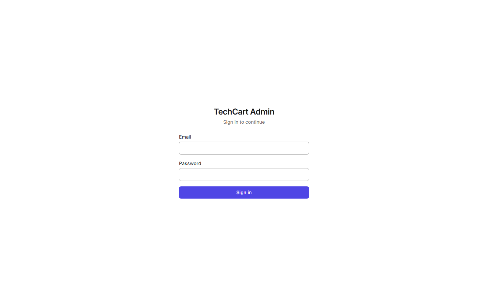

1. Enter **Email** and **Password** and click **Sign in**.
2. A 6-digit code is sent to your email. Enter it in **Verification code** and click
   **Verify & sign in**.

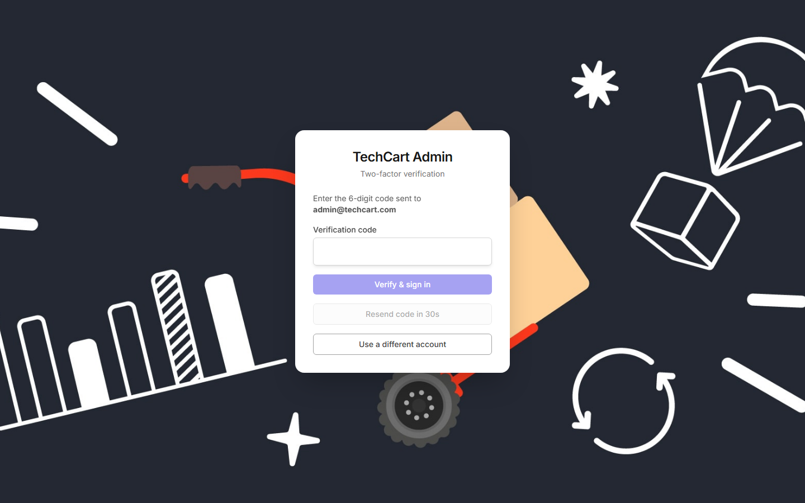

- A correct password alone never signs you in — the code is always required.
- **Resend code** is available after a 30-second cooldown (_"Resend code in 29s"_).
- **Use a different account** returns to the password step.

> **Current environments use a fixed code, `123456`, for every account.** This is a
> deliberate pre-launch testing convenience and must not carry into a real production
> launch (recorded as an amendment in `docs/srs/features/0.3-authentication.md`).

| Message                                      | Meaning                                                          |
| -------------------------------------------- | ---------------------------------------------------------------- |
| _Invalid email or password._                 | Unknown email, wrong password, or a shopper (non-admin) account. |
| _Your account has been deactivated._         | A super-admin has switched your account off.                     |
| _The code you entered is incorrect._         | Wrong or already-used verification code.                         |
| _Your verification session expired._         | Too long between the password and code steps — start again.      |
| _Too many attempts. Please try again later._ | Rate limit hit (5 sign-ins / 15 min). Wait and retry.            |

### Forgotten password

There is no self-service "forgot password" link on the sign-in screen. Password
resets are issued by the backend's reset endpoints (`request-password-reset` /
`reset-password`) — a super-admin creating your account triggers a reset email, and
you can request one the same way. Once signed in you can change your own password from
[My Account](#15-my-account).

---

## 3. Console layout

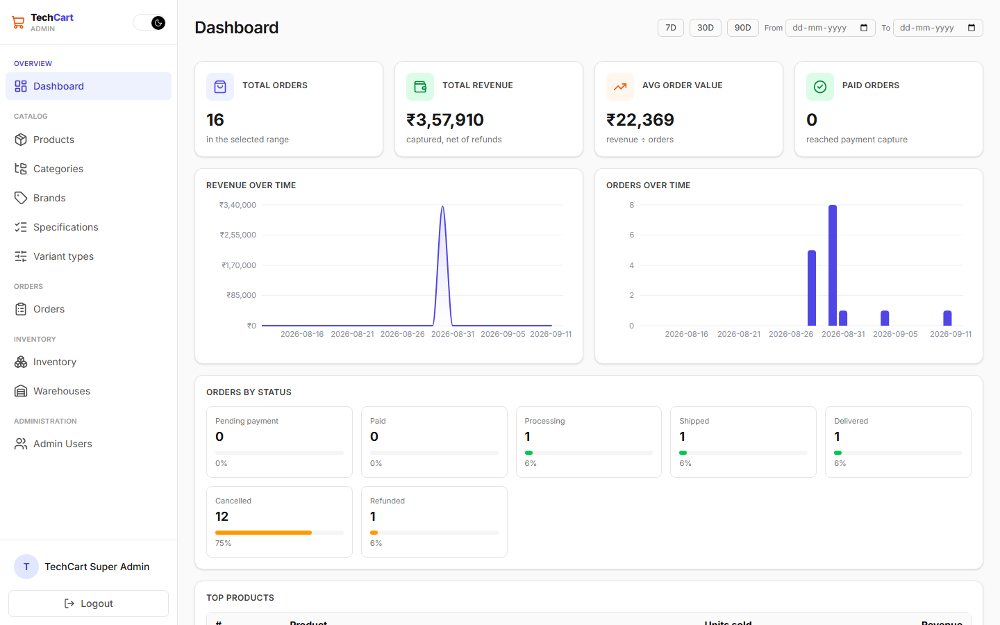

- **Sidebar** — grouped navigation: **Overview** (Dashboard), **Catalog** (Products,
  Categories, Brands, Specifications, Variant types), **Orders**, **Inventory**
  (Inventory, Warehouses), **Administration** (Admin Users). Groups and items you
  don't have access to are hidden.
- On a **tablet** width the sidebar is a narrow icon rail — hover an icon for its
  label. On a **desktop** width it widens to show icons and labels.
- On a **phone** the sidebar is off-screen; tap the menu button in the top bar to
  open it.

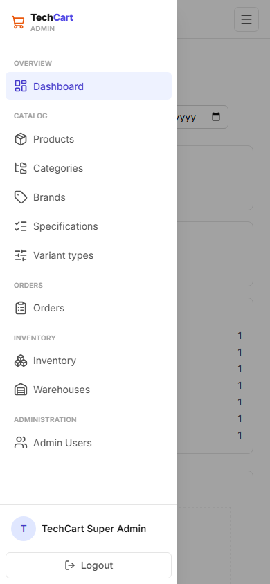

- **Header** — the _TechCart ADMIN_ wordmark, linking to the dashboard.
- **Footer** (bottom of the sidebar) — your initial and name (the name links to **My
  Account**) and a **Logout** button.
- Detail and edit screens show a back-link breadcrumb such as _Products / Edit
  product_.

Every list screen (Products, Brands, Categories, Orders, Inventory, Warehouses, Admin
Users) uses the same table: a search box, optional filter dropdowns with a **Clear
filters** button, sortable column headers, and a footer with the record range, page
numbers, and a page-size selector.

---

## 4. Dashboard

The dashboard is the landing page (`/`). What it shows depends on your role.

### Sales dashboard — order-manager & super-admin

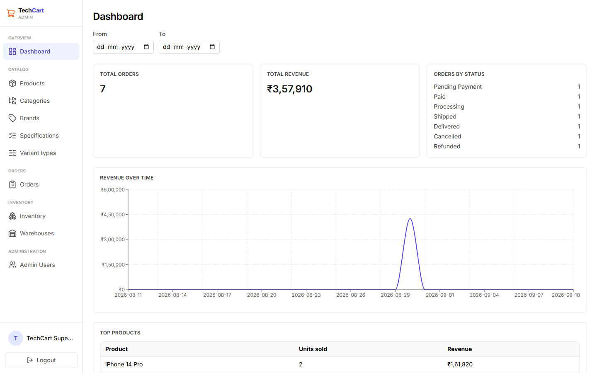

- **Total orders** and **Total revenue** summary cards, plus **Orders by status**.
- **Revenue over time** — a line chart.
- **Top products** — units sold and revenue per product.
- A **date range** picker (**From** / **To**). Set either date to filter; a **Reset
  to last 30 days** link appears. With both blank it shows the last 30 days.

### Catalog dashboard — catalog-manager

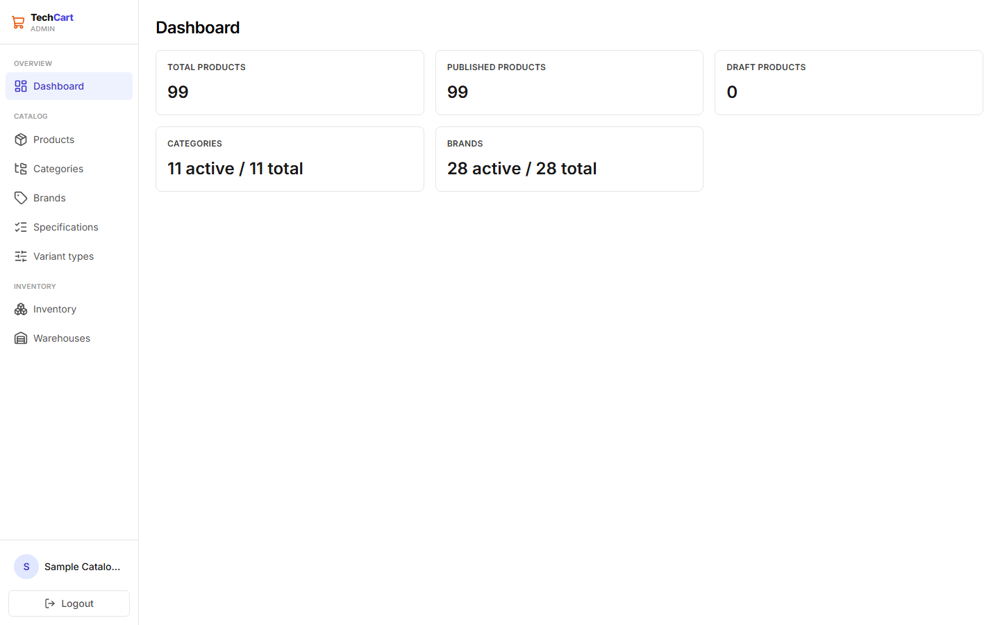

A catalog-manager sees a simpler dashboard with only **Total products**, **Published
products**, **Draft products**, **Categories** (_active / total_), and **Brands**
(_active / total_) — no date range and no charts.

---

## 5. How to add a brand

**Catalog → Brands** (`/brands`).

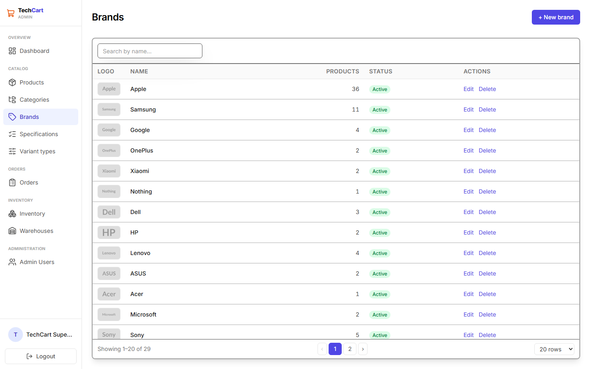

1. Click **+ New brand**. The form opens on the right.

   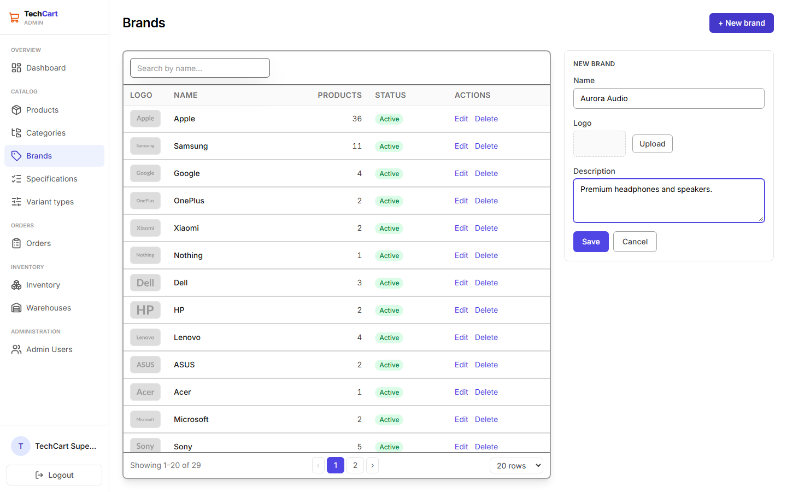

   | Field           | Notes                                                         |
   | --------------- | ------------------------------------------------------------- |
   | **Name**        | Required.                                                     |
   | **Slug**        | Shown only when editing — generated from the name, read-only. |
   | **Logo**        | Optional. Click **Upload** to pick a JPEG, PNG, or WebP file. |
   | **Description** | Optional.                                                     |

2. Click **Save**.

### On the list

- Columns: **Logo**, **Name**, **Products** (count), **Status**, **Actions**.
- The **Status** badge (_Active_ / _Inactive_) is a toggle — click it to switch. The
  form does **not** set status; only this toggle does.
- **Edit** reopens the form. **Delete** asks _Delete "…"? This can't be undone._
- A brand that still has products cannot be deleted — you get _"Cannot delete
  brand"_. Reassign or remove its products first.
- Search by name with the box above the table.

---

## 6. How to add a category or subcategory

**Catalog → Categories** (`/categories`). Categories are **two levels** — a top-level
category and its subcategories.

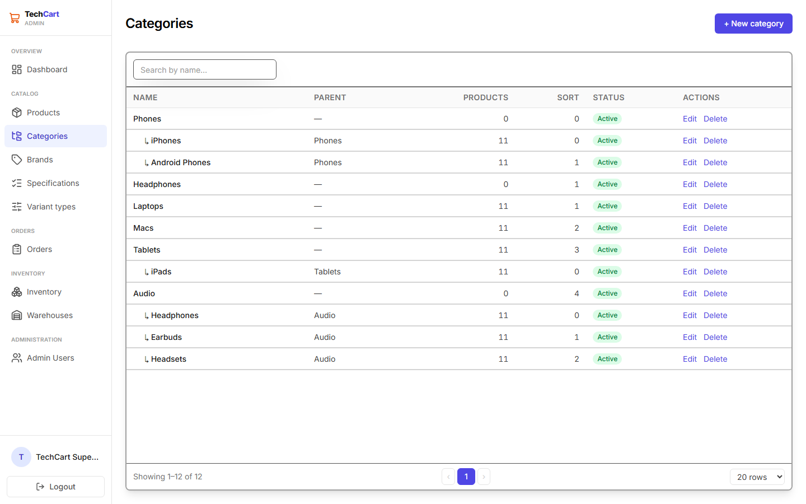

1. Click **+ New category**.

   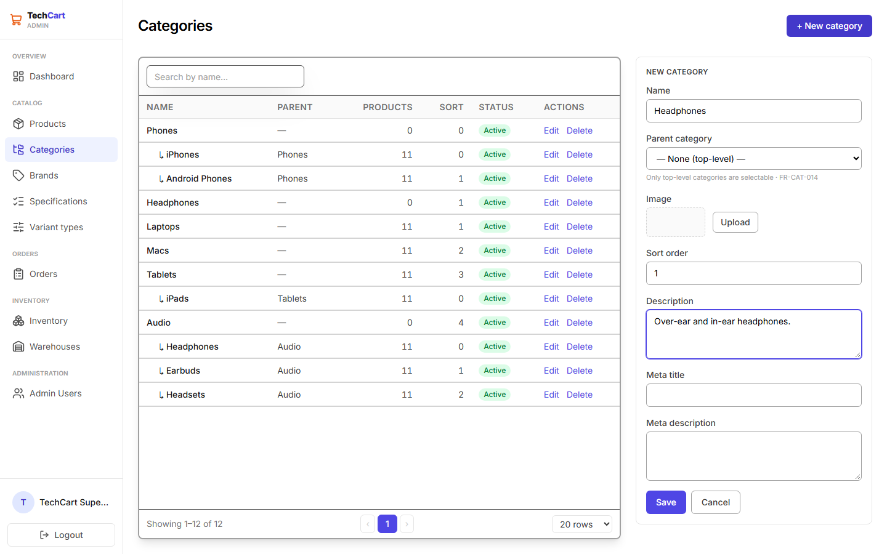

   | Field                                 | Notes                                                                                                                                                               |
   | ------------------------------------- | ------------------------------------------------------------------------------------------------------------------------------------------------------------------- |
   | **Name**                              | Required.                                                                                                                                                           |
   | **Slug**                              | Editing only — generated, read-only.                                                                                                                                |
   | **Parent category**                   | _— None (top-level) —_ makes a top-level category. Choosing a top-level category here makes this a **subcategory** of it. Only top-level categories can be parents. |
   | **Image**                             | Optional (JPEG / PNG / WebP).                                                                                                                                       |
   | **Sort order**                        | A number — lower sorts first within its level.                                                                                                                      |
   | **Description**                       | Optional.                                                                                                                                                           |
   | **Meta title** / **Meta description** | Optional SEO text; the storefront falls back to computed values when blank.                                                                                         |

2. Click **Save**.

### On the list

- Columns: **Name**, **Parent**, **Products**, **Sort**, **Status**, **Actions**.
- Subcategories are shown indented under their parent with a `↳` marker.
- The **Status** badge toggles active/inactive on click.
- **Delete** is blocked while the category still has products **or** subcategories —
  _"Cannot delete category"_.

---

## 7. How to define a category's specification schema

**Catalog → Specifications** (`/specifications`). Each category has **one**
specification schema. It drives the specification inputs on the product form and the
buyer-facing spec filters.

1. Choose a **Category** from the dropdown at the top right.
2. Click **+ Add group** and rename it (click the group name and edit it inline).
3. In the group, click **+ Add field** for each attribute:

   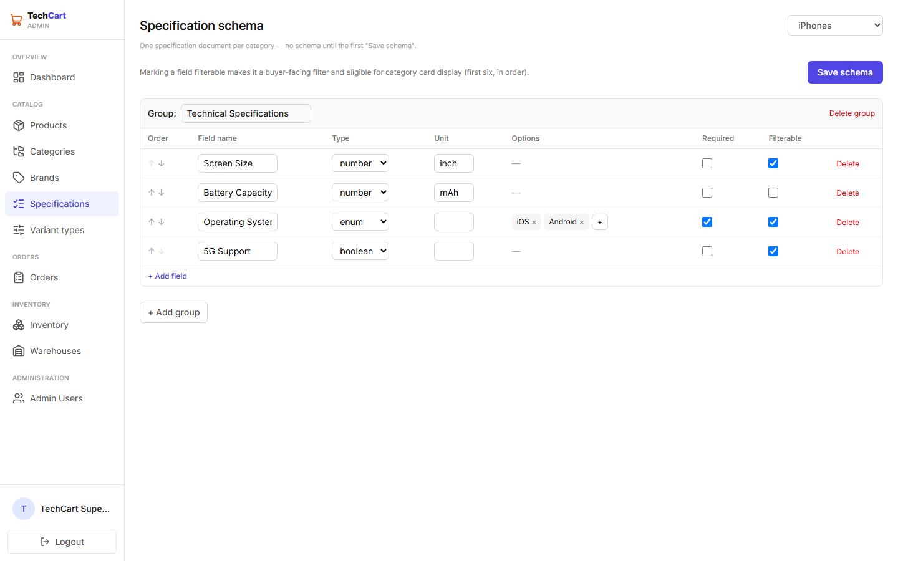

   | Column         | Notes                                                                                                                                                    |
   | -------------- | -------------------------------------------------------------------------------------------------------------------------------------------------------- |
   | **Order**      | `↑` / `↓` move a field within the group.                                                                                                                 |
   | **Field name** | e.g. _Driver Size_.                                                                                                                                      |
   | **Type**       | **text**, **number**, **boolean**, or **enum**.                                                                                                          |
   | **Unit**       | e.g. _mm_, _GB_. Optional.                                                                                                                               |
   | **Options**    | **enum only** — click `+` to add a value, `×` to remove one.                                                                                             |
   | **Required**   | Whether products must supply a value.                                                                                                                    |
   | **Filterable** | Exposes the field as a buyer filter. Disabled for **text** fields. The first **six** filterable fields (in order) also appear on category product cards. |

4. Click **Save schema** to persist your changes.

### What saves immediately vs. on "Save schema"

- Adding groups/fields and editing an **unsaved** field stays local until **Save
  schema** (a full replace).
- On an **already-saved** schema: renaming a group, deleting a group or field, and
  toggling **Filterable** on a saved field take effect immediately.
- Deleting a field that products are using is blocked — _"This field is in use by N
  products"_.

---

## 8. How to define a category's variant axes

**Catalog → Variant types** (`/variant-types`). Each category has **one** set of
variant axes — the choices (colour, size, …) a product in that category can vary by.
These definitions drive the product form only.

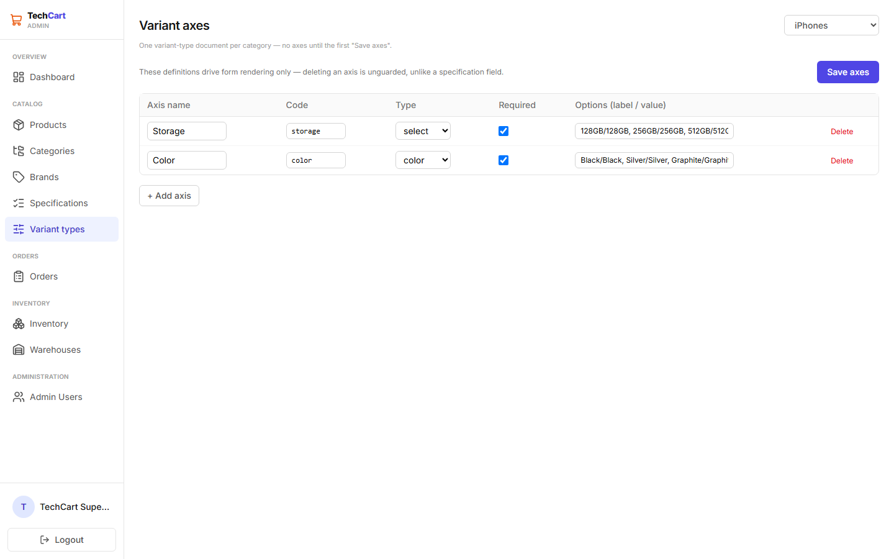

1. Choose a **Category**.
2. Click **+ Add axis** for each axis:

   | Column        | Notes                                                                                                                                           |
   | ------------- | ----------------------------------------------------------------------------------------------------------------------------------------------- |
   | **Axis name** | e.g. _Colour_.                                                                                                                                  |
   | **Code**      | A short machine key, e.g. `colour`.                                                                                                             |
   | **Type**      | **text**, **select**, **color**, or **number**.                                                                                                 |
   | **Required**  | Whether every variant must set this axis.                                                                                                       |
   | **Options**   | For **select** / **color**: a comma-separated list of `label/value` pairs, e.g. `Black/#000000, Silver/#c0c0c0`. Other types don't use options. |

3. Click **Save axes**.

> Unlike specification fields, **deleting a variant axis is not guarded** — it only
> affects how the product form renders, not stored product data.

---

## 9. How to add a product

**Catalog → Products** (`/products`).

### 9.1 The product list

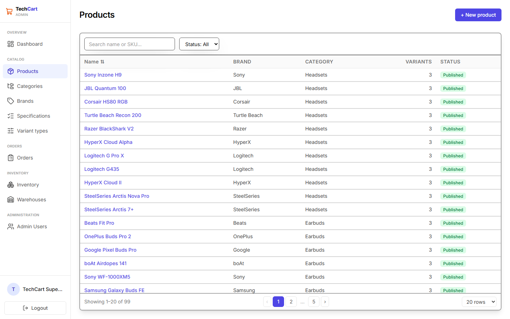

- Columns: **Name** (links to detail), **Brand**, **Category**, **Variants** (count),
  **Status** (_Draft_ / _Published_ / _Archived_).
- Search by name or SKU; filter by **Status**.

### 9.2 Create the product

1. Click **+ New product** → the form opens at `/products/new`.

   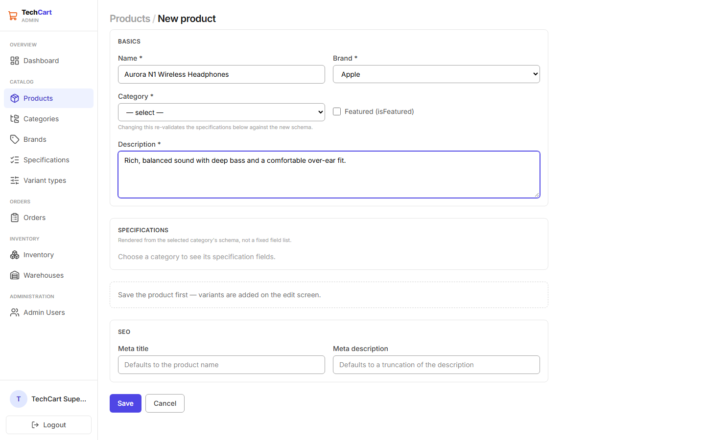

   **Basics**

   | Field                     | Notes                                                                                                                       |
   | ------------------------- | --------------------------------------------------------------------------------------------------------------------------- |
   | **Name**                  | Required.                                                                                                                   |
   | **Brand**                 | Required — pick from existing brands.                                                                                       |
   | **Category**              | Required. Nested categories show as _Parent › Child_. Changing this re-validates and clears the specification values below. |
   | **Featured (isFeatured)** | Optional flag.                                                                                                              |
   | **Description**           | Required.                                                                                                                   |

   **Specifications** — rendered from the chosen category's schema (section 7). Each
   field uses the control for its type (checkbox, dropdown, number, or text). A
   category with no schema shows a note instead.

   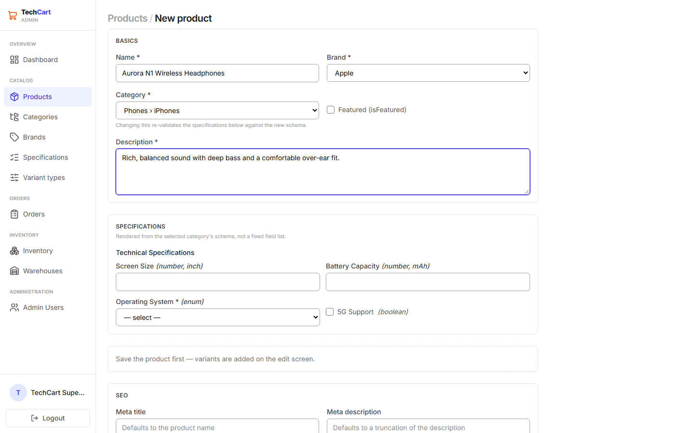

   **SEO** — optional **Meta title** and **Meta description**; both default from the
   name/description when blank.

2. Click **Save**. You are taken to the product's **edit** screen, where variants can
   now be added.

> A product carries **no price, SKU, or stock of its own** — every sellable unit is a
> **variant**. A product with no variants can't be sold.

### 9.3 Add variants

On the edit screen, in the **Variants** card, click **+ Add variant**.

| Field                    | Notes                                                                                                                        |
| ------------------------ | ---------------------------------------------------------------------------------------------------------------------------- |
| _(one control per axis)_ | A colour swatch, a dropdown, a number, or a text box — matching the axis type from section 8. Labelled _(axis name) (type)_. |
| **SKU**                  | Required. Unique across the catalogue.                                                                                       |
| **MRP (₹)**              | Required — the list price.                                                                                                   |
| **Discount %**           | Optional.                                                                                                                    |
| _Selling price_          | Shown as a live preview — _"(preview — server-computed)"_. The server calculates the final price on save.                    |
| **Active**               | Whether this variant is sellable.                                                                                            |
| **Weight (optional)**    | Optional.                                                                                                                    |
| **Images 1–2**           | 1–2 images per variant.                                                                                                      |

**Images**

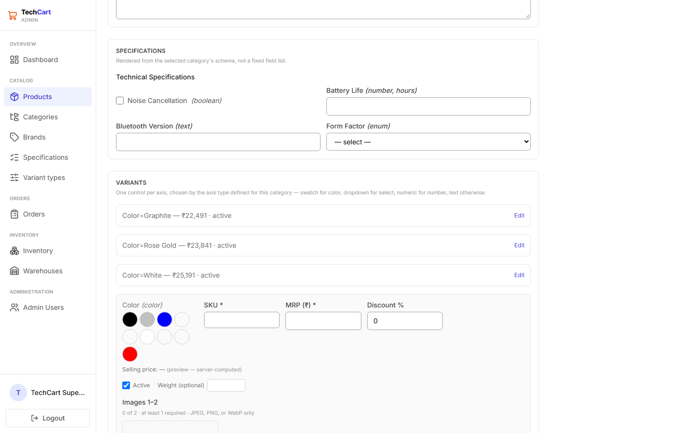

- Click **+ Upload** and choose a JPEG, PNG, or WebP file.
- Use the **◉ Primary** / **○ Primary** toggle to pick the main image.
- Give each image **alt text**; **Remove** deletes it.

Click **Add variant** (or **Save variant** when editing one). Repeat for each
variant.

Errors surfaced inline: _"SKU is required."_, _"Enter a valid MRP."_, a duplicate SKU,
duplicate variant attributes, or a specification-validation failure.

### 9.4 Review the product

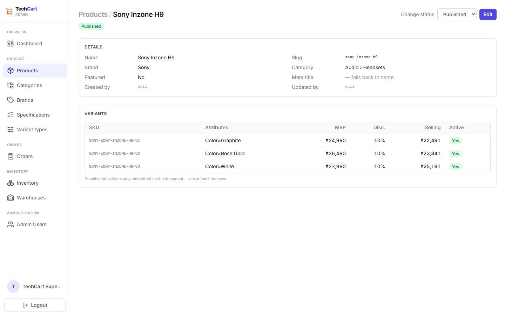

The detail screen (`/products/:id`) is read-only: **Details**, **Specifications**, and
a **Variants** table (SKU, attributes, MRP, discount, selling price, active). Use
**Edit** to change anything.

### 9.5 Publish it

On the detail screen, use the **Change status** dropdown:

| Status        | Effect                                                   |
| ------------- | -------------------------------------------------------- |
| **Draft**     | Not visible in the storefront.                           |
| **Published** | Visible and purchasable in the storefront.               |
| **Archived**  | Hidden from the storefront, kept in the admin catalogue. |

A product must be **Published** — with at least one active, in-stock variant — to
appear to shoppers.

---

## 10. How to add a warehouse

**Inventory → Warehouses** (`/warehouses`).

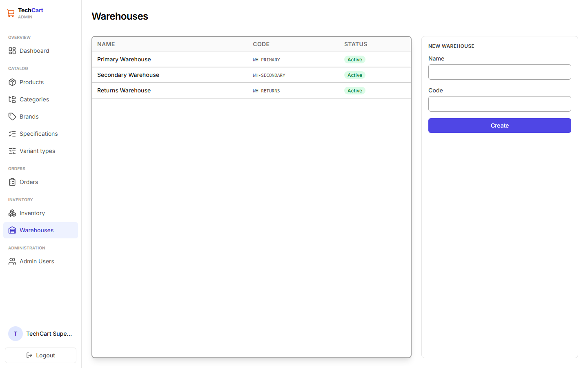

1. In the **New warehouse** panel, fill **Name** and **Code** (e.g.
   _Primary Warehouse_ / `WH-PRIMARY`).
2. Click **Create**.

Warehouses are a small fixed set — there is **no edit or delete**. The list shows
**Name**, **Code**, and **Status**. The order in which warehouses are created matters:
carts draw stock from warehouses in creation order.

---

## 11. How to set inventory stock

**Inventory → Inventory** (`/inventory`). There is one row per **variant × warehouse**
— rows are created automatically when a variant or a warehouse is added, starting at
zero.

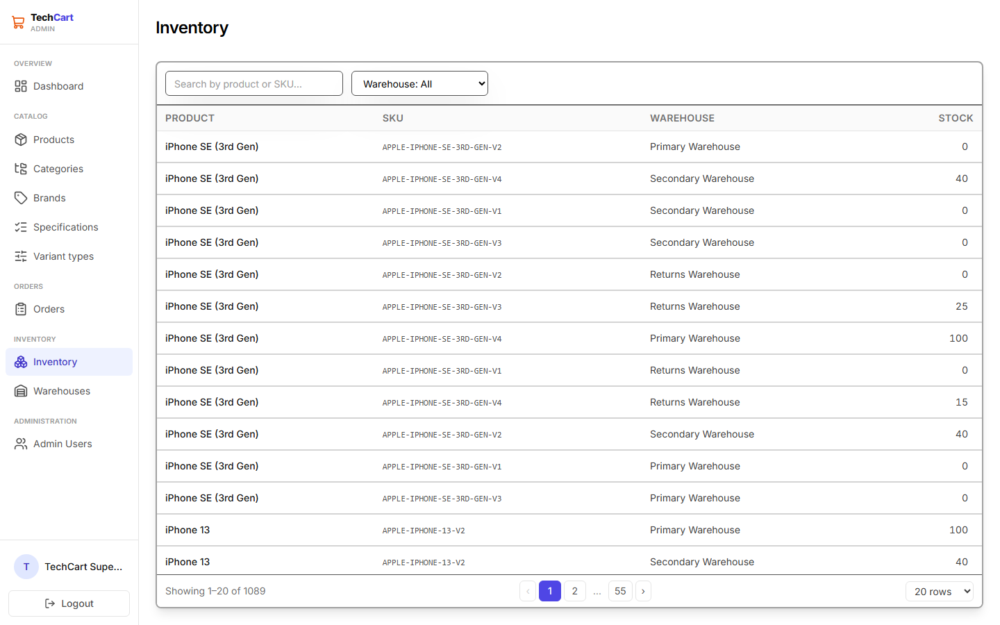

- Columns: **Product**, **SKU**, **Warehouse**, **Stock**.
- Search by product or SKU; filter by **Warehouse**.

To change a count:

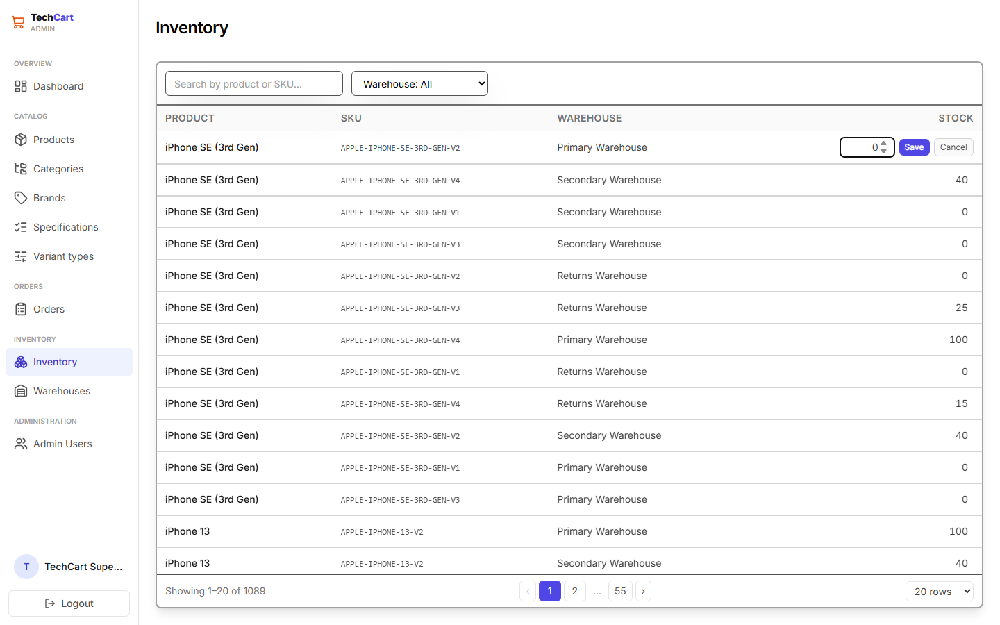

1. Click the number in the **Stock** cell — it becomes an input.
2. Type the new whole number and click **Save** (**Cancel** discards).

Validation: _"Enter a whole number."_ for non-integers; a negative value is rejected
with an inline message (_NEGATIVE_STOCK_REJECTED_).

A product shows as **Out of stock** to shoppers when every active variant has zero
stock across all warehouses.

---

## 12. Orders

**Orders** (`/orders`) — order-manager and super-admin only.

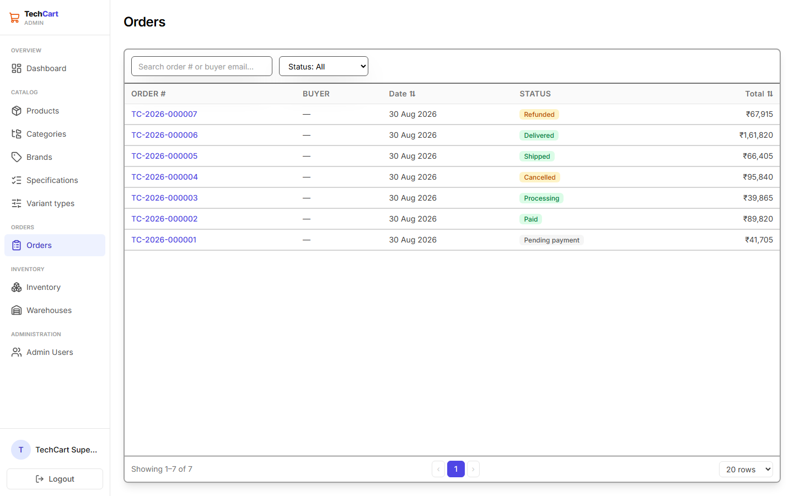

- Columns: **Order #** (links to detail), **Buyer** (email), **Date**, **Status**,
  **Total**. Sort by date or total.
- Search by order number or buyer email; filter by **Status**.

### Order detail

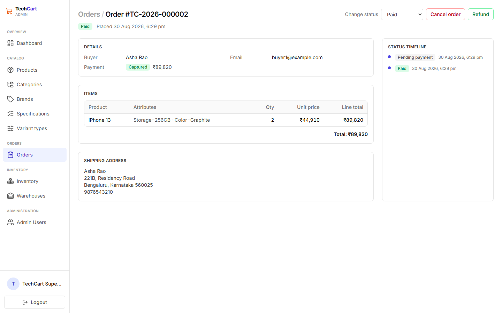

The detail screen shows **Details** (buyer, email, tracking, payment, cancellation
reason), an **Items** table, the **Shipping address**, and a **Status timeline**.

Actions in the top-right:

| Action            | When it shows                                        | What it does                                                                                        |
| ----------------- | ---------------------------------------------------- | --------------------------------------------------------------------------------------------------- |
| **Change status** | Always                                               | A dropdown offering only the **legal next statuses** (see [section 16](#order-status-transitions)). |
| **Cancel order**  | Status is _Pending payment_ or _Paid_                | Opens a modal — enter a **Cancellation reason** (shown to the buyer), then **Cancel order**.        |
| **Refund**        | Payment status is _captured_ or _partially refunded_ | Opens the refund modal — see [section 13](#13-refunds--payments).                                   |

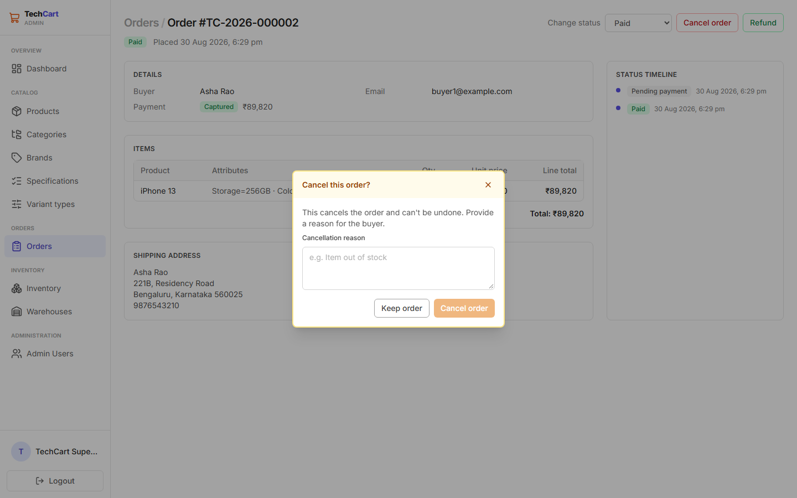

---

## 13. Refunds & payments

Every order detail shows a **payment** summary — status and amount, plus the Razorpay
payment id once captured.

The **Refund** button appears only when the payment status is **captured** or
**partially refunded**.

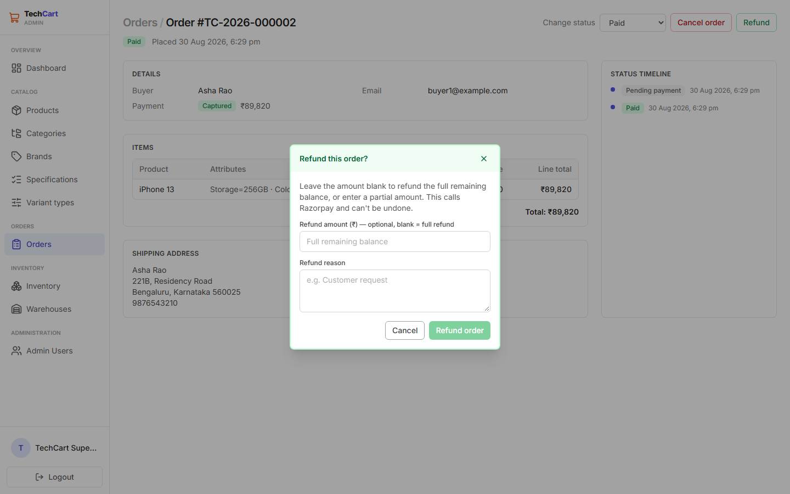

In the modal:

| Field                 | Notes                                                                                           |
| --------------------- | ----------------------------------------------------------------------------------------------- |
| **Refund amount (₹)** | Optional. **Blank = full refund** of the remaining balance. Enter a value for a partial refund. |
| **Refund reason**     | Required.                                                                                       |

Then **Refund order**.

- A **full** refund transitions the order to **Refunded**.
- A **partial** refund updates the payment only — the order status is unchanged
  (there is no "partially refunded" order status).
- Refunds call Razorpay and cannot be undone.

`"Refunded"` is not offered as a plain **Change status** option — refunding only
happens through this flow.

---

## 14. Admin users

**Administration → Admin Users** (`/admin-users`) — **super-admin only**.

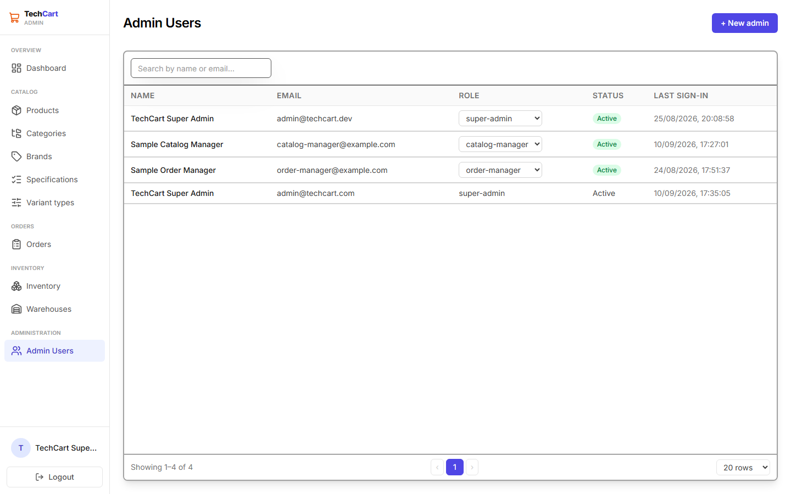

- Columns: **Name**, **Email**, **Role**, **Status**, **Last sign-in**.

### Create an admin

1. Click **+ New admin**.

   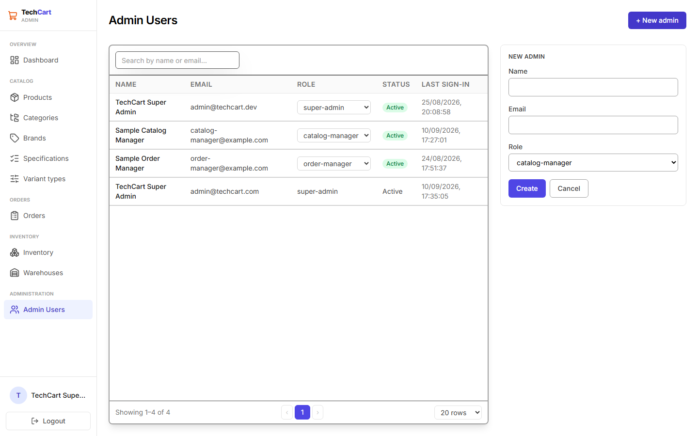

   | Field     | Notes                                                 |
   | --------- | ----------------------------------------------------- |
   | **Name**  | Required.                                             |
   | **Email** | Required.                                             |
   | **Role**  | _catalog-manager_, _order-manager_, or _super-admin_. |

2. Click **Create**. **No password is set here** — the new admin receives a
   password-reset email and chooses their own. They then sign in with the normal
   password + code flow.

### Edit roles & status

- On another admin's row, the **Role** cell is a dropdown and the **Status** badge is
  a click-toggle — changes apply immediately.
- **Your own row** shows role and status as plain text — you cannot change your own
  role or deactivate yourself.

---

## 15. My account

**My Account** (`/account`) — available to every admin role.

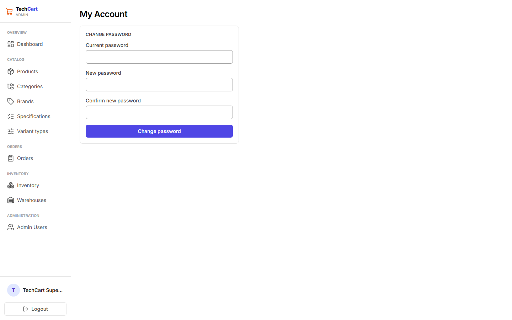

**Change password**:

| Field                    | Notes                            |
| ------------------------ | -------------------------------- |
| **Current password**     | Required.                        |
| **New password**         | Required, at least 8 characters. |
| **Confirm new password** | Must match.                      |

Click **Change password**. A success line confirms it and the fields clear. Changing
your password signs out your other sessions; the one you're using stays active.

Errors: _"New password and confirmation don't match."_, _"Current password is
incorrect."_

---

## 16. Reference

### Role → capability

See [section 1](#1-roles--access).

### Order status transitions

The **Change status** dropdown only offers these next steps:

| From            | Allowed next          |
| --------------- | --------------------- |
| Pending payment | Paid, Cancelled       |
| Paid            | Processing, Cancelled |
| Processing      | Shipped               |
| Shipped         | Delivered             |
| Delivered       | _(none)_              |
| Cancelled       | _(none)_              |
| Refunded        | _(none)_              |

_Refunded_ is reached only via the **Refund** action (section 13). _Cancelled_ for a
_Pending payment_ / _Paid_ order is done via **Cancel order** (which also records a
reason).

### Common messages

| Code / message                       | Where           | Meaning                                                       |
| ------------------------------------ | --------------- | ------------------------------------------------------------- |
| _Invalid email or password._         | Sign-in         | Bad credentials or a non-admin account.                       |
| _Your account has been deactivated._ | Sign-in         | Ask a super-admin to reactivate it.                           |
| _The code you entered is incorrect._ | Sign-in (2FA)   | Wrong/used code.                                              |
| _Your verification session expired._ | Sign-in (2FA)   | Restart the sign-in.                                          |
| _Too many attempts…_                 | Sign-in         | Rate limited — wait.                                          |
| `BRAND_IN_USE`                       | Brands          | Brand still has products.                                     |
| `CATEGORY_IN_USE`                    | Categories      | Category still has products or subcategories.                 |
| `SPECIFICATION_FIELD_IN_USE`         | Specifications  | Field is used by products.                                    |
| `DUPLICATE_SKU`                      | Product variant | SKU already exists.                                           |
| `DUPLICATE_VARIANT_ATTRIBUTES`       | Product variant | Another variant has the same attribute combination.           |
| `SPECIFICATION_VALIDATION_FAILED`    | Product         | A required spec value is missing or invalid for the category. |
| `NEGATIVE_STOCK_REJECTED`            | Inventory       | Stock cannot be set below zero.                               |
| `CANNOT_MODIFY_OWN_ACCOUNT`          | Admin Users     | You can't change your own role/status.                        |
| `INSUFFICIENT_STOCK`                 | Orders / cart   | Not enough stock to fulfil the requested quantity.            |
