# TechCart Buyer App — User Manual

The TechCart storefront is where you browse the catalogue, manage a cart, check out,
and track your orders. It runs in any modern web browser on desktop or mobile.

**Contents**

1. [Getting started](#1-getting-started)
2. [Creating an account & signing in](#2-creating-an-account--signing-in)
3. [Browsing products](#3-browsing-products)
4. [Searching](#4-searching)
5. [Category pages & filtering](#5-category-pages--filtering)
6. [Product details](#6-product-details)
7. [Your cart](#7-your-cart)
8. [Checkout & payment](#8-checkout--payment)
9. [Your orders](#9-your-orders)
10. [Your account](#10-your-account)
11. [Saved addresses](#11-saved-addresses)
12. [Header & navigation reference](#12-header--navigation-reference)
13. [Reference tables](#13-reference-tables)

---

## 1. Getting started

Open the storefront URL in your browser. The home page, category pages, search, and
product pages are all **public** — you can browse the entire catalogue without an
account.

You need to sign in only to:

- add items to a cart or open the cart
- check out and pay
- view your orders
- manage your profile and saved addresses

If you click an action that needs an account (for example **Add to Cart**), you are
taken to the sign-in page and returned to where you were once you sign in.

The header stays at the top of every page and gives you search, the categories menu,
your cart, and your account menu — see [section 12](#12-header--navigation-reference).

---

## 2. Creating an account & signing in

There is **no password** for shoppers. You sign in either with Google or with a
one-time code (OTP) sent to your email. Signing in for the first time creates your
account automatically.

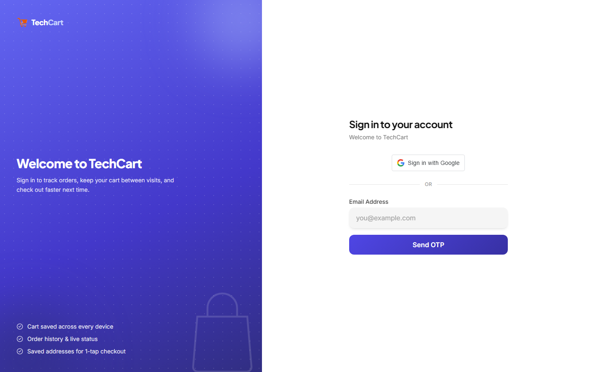

The sign-in page has two ways in:

### Google

Click **Sign in with Google** and choose your Google account. If you have used Google
on this device before, a **One Tap** prompt may appear automatically near the top of
the screen — selecting your account there signs you in directly.

> If your email is already registered as a **TechCart admin** account, Google sign-in
> is refused with _"This email is registered as an admin account. Please sign in as a
> buyer instead."_ Use a different email.

### Email one-time code

1. Enter your address in **Email Address** and click **Send OTP** (the button shows
   _"Sending…"_ briefly).
2. Check your email for a 6-digit code and type it into **Verification Code**.
3. Click **Verify & Sign In**.

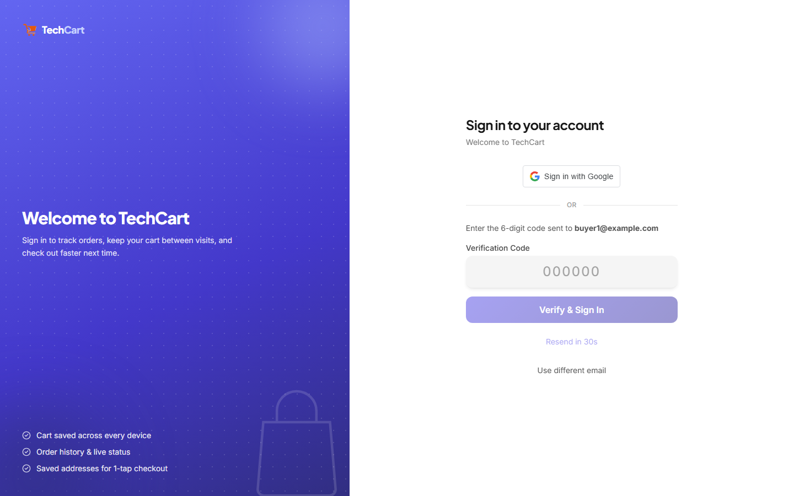

- **Resend OTP** is available after a 30-second cooldown — until then the button
  reads _"Resend in 29s"_, _"…28s"_, and so on.
- **Use different email** takes you back to step 1.

| Message                                             | Meaning                                            |
| --------------------------------------------------- | -------------------------------------------------- |
| _The OTP you entered is invalid. Please try again._ | Wrong code — re-check and retype it.               |
| _The OTP has expired. Please request a new one._    | The code timed out — click **Resend OTP**.         |
| _This email is registered as an admin account…_     | Use a shopper email, or the admin console instead. |

### Staying signed in

Your session persists in the browser. The header shows your initials once you are
signed in; open that menu and choose **Sign out** to end the session.

If you opened sign-in by clicking a protected action, you are returned to that page
afterwards (for example straight back to the cart).

---

## 3. Browsing products

The home page shows the whole catalogue as a grid of product cards.

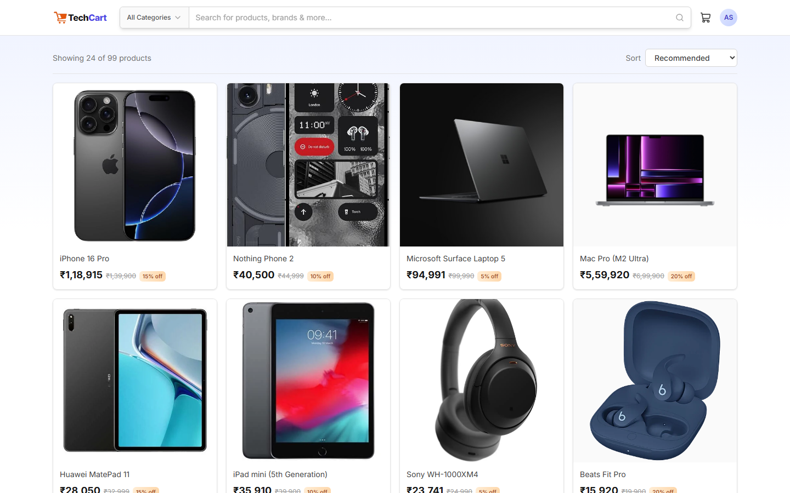

- Each card shows the image, product name, price, and — when there is a discount — the
  original price struck through with a **"{n}% off"** badge.
- A product with no available stock shows an **"Out of stock"** ribbon on the image.
- Click anywhere on a card to open the product's detail page.

### Sorting

Use the **Sort** control at the top right of the grid:

| Option                      | Order                          |
| --------------------------- | ------------------------------ |
| **Recommended** _(default)_ | A varied mix across categories |
| **Newest first**            | Most recently added first      |
| **Price: Low to High**      | Cheapest first                 |
| **Price: High to Low**      | Most expensive first           |

### Loading more

The home grid loads more products automatically as you scroll — there are no page
numbers here. While the next batch loads, placeholder cards appear at the bottom.
When you reach the end you see **"You've reached the end"**.

Prices everywhere are shown in Indian Rupees with no decimals, e.g. `₹1,24,999`.

---

## 4. Searching

### The search box

The search box is in the header (on a phone, tap the magnifier icon to open it).
Type at least two characters and a **suggestions** dropdown appears with up to five
matching **Categories** and up to five matching **Products**.

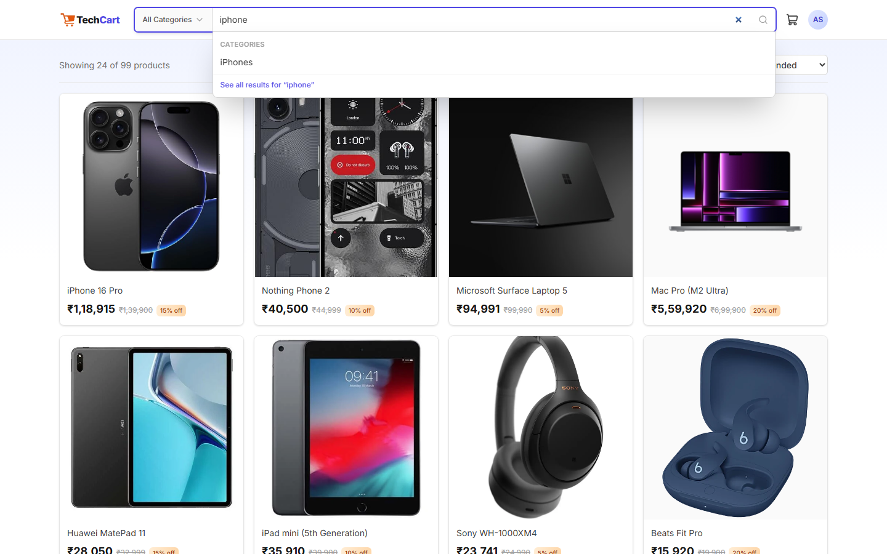

- Click a suggestion to jump straight to that category or product.
- Click **"See all results for "…""**, or press Enter, to open the full results page.

### The results page

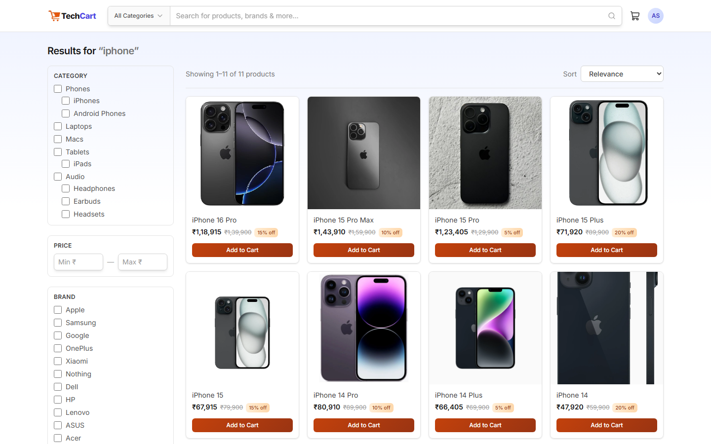

- The heading reads **Results for "your term"**.
- A filter rail on the left (desktop) lets you narrow by **Category**, **Price**,
  **Brand**, **In stock**, and **On sale**.
- **Sort** options here are **Relevance** _(default)_, **Newest first**,
  **Price: Low to High**, and **Price: High to Low**.
- Results are paged with numbered page buttons when there is more than one page.

If nothing matches you see either **No results for "your term"**, or — when filters
are hiding everything — **"No products match your filters"**.

---

## 5. Category pages & filtering

Open a category from the **All Categories** menu in the header, from a search
suggestion, or from a breadcrumb link.

- A breadcrumb at the top shows **Home / (parent category) / this category**.
- Products are listed one per row.
- The count line reads **"Showing 1–10 of 42 products"**.
- **Sort** offers **Newest first** _(default)_, **Price: Low to High**, and
  **Price: High to Low**.
- Pages are numbered — use **‹ Prev**, the page numbers, and **Next ›**. Changing a
  page scrolls you back to the top.

### The filter rail

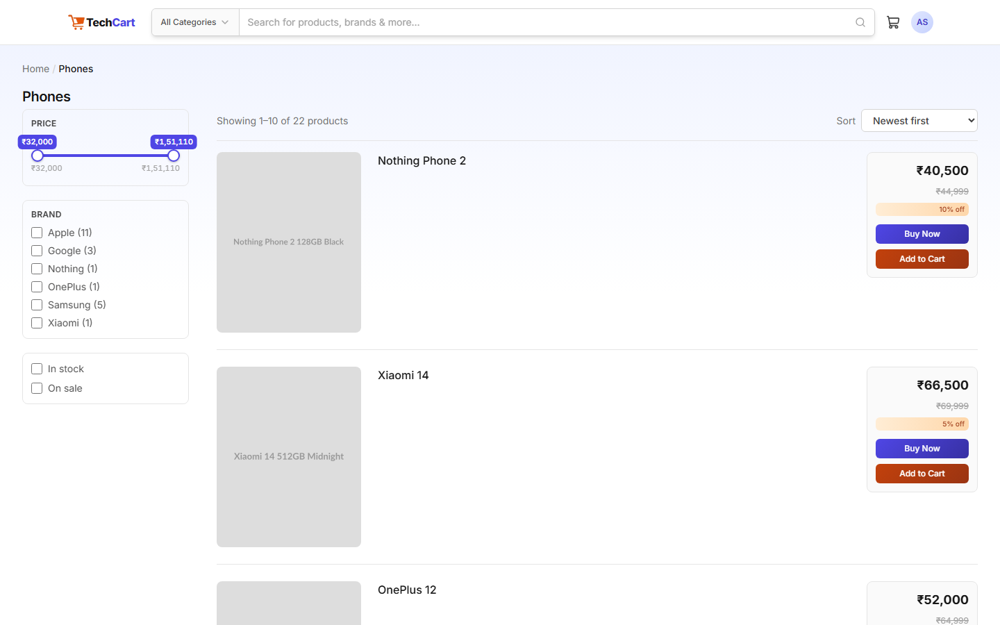

| Section                    | How it works                                                                                                                                      |
| -------------------------- | ------------------------------------------------------------------------------------------------------------------------------------------------- |
| **Price**                  | A two-handle slider when price bounds are known, otherwise **Min** / **Max** boxes. Changes apply when you release the handle or leave the field. |
| **Brand**                  | Checkboxes, each labelled with the brand name and its product count. Select as many as you like.                                                  |
| **(Specification facets)** | One section per filterable spec for this category — a number range, a single checkbox, or a list of values (one value at a time).                 |
| **Options**                | Product variant choices such as colour. **One option at a time across all axes.**                                                                 |
| **In stock**               | Hide out-of-stock products.                                                                                                                       |
| **On sale**                | Show only discounted products.                                                                                                                    |

> **Note:** The specification and variant-option facets rely on a search index. On a
> deployment without that index provisioned, those facet sections may be empty; the
> **Price**, **Brand**, **In stock**, and **On sale** filters always work.

### On a phone

The rail is hidden. Tap **Filters** (it shows a badge with the number of active
filters) to open a slide-in panel with the same controls, then tap **Done**.

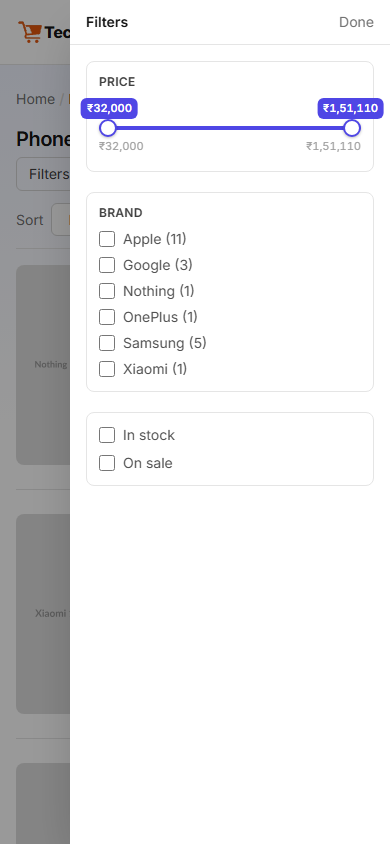

---

## 6. Product details

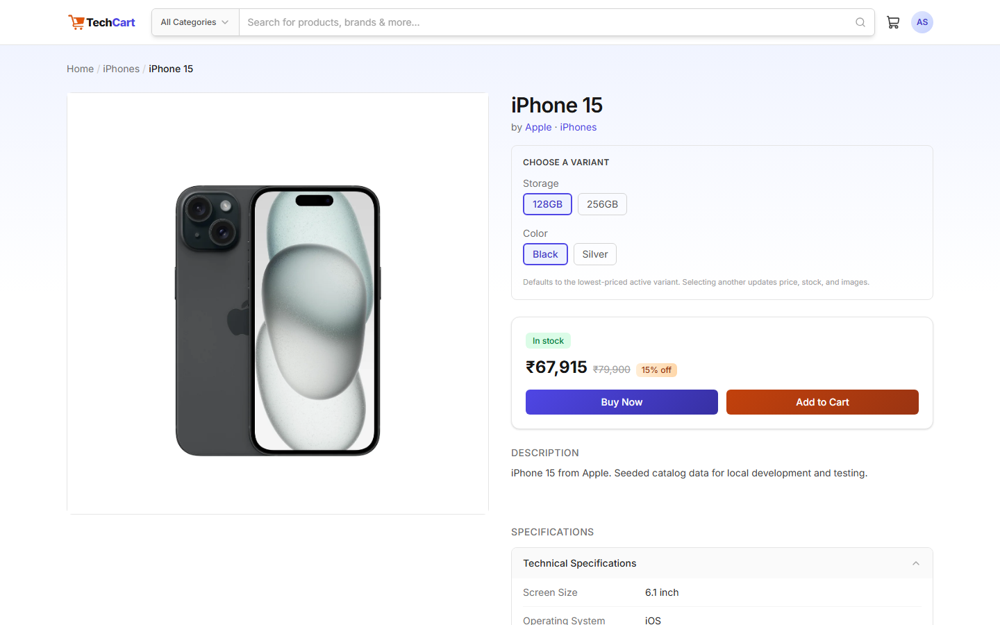

The product page has:

- **Gallery** — a large image with thumbnail buttons below it when there is more than
  one image.
- **Title block** — the product name and _"by (brand) · (category)"_, where the
  category is a link.
- **Buy box** — an availability badge, the price, and two buttons: **Buy Now** and
  **Add to Cart**.
- **Description** and **Specifications** below.

### Choosing a variant

If the product comes in variants (for example different colours or sizes), a
**"Choose a variant"** card appears:

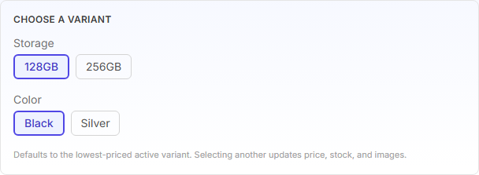

- Each axis (e.g. _Colour_) shows a row of value buttons.
- The selected value is filled in; a combination that isn't available is greyed out
  and struck through.
- Selecting a different variant updates the **price, availability, and images**
  immediately — the page does not reload. The page opens on the lowest-priced
  in-stock variant.

### Availability

The badge shows only two states: **In stock** (green) or **Out of stock** (grey).
When a variant is out of stock the buy box shows a disabled **Out of stock** control
instead of the price and buttons.

### Specifications

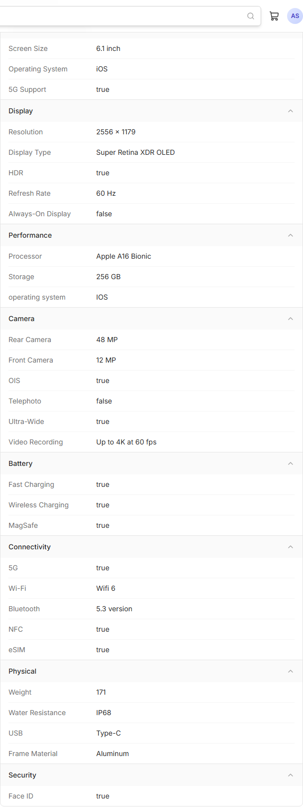

Below the buy box, a **Specifications** section lists the product's attributes in
groups (for example _Technical Specifications_, _Display_). On a wide screen every
group is open and you can collapse any of them; on a narrow screen they start closed
and only one opens at a time. Each value shows its unit where one is defined (e.g.
_6.3 inch_). The section is hidden for a product that has no specification values.

---

## 7. Your cart

You must be signed in to use the cart. The header cart icon links to it and shows a
badge with the number of items once you have any.

### Adding items

**Add to Cart** appears on product cards and in the product buy box. Its label
reflects the current state:

| Button           | What it means                                                     |
| ---------------- | ----------------------------------------------------------------- |
| **Add to Cart**  | Adds the selected variant to your cart.                           |
| **Go to Cart**   | That variant is already in your cart — clicking goes to the cart. |
| **Out of stock** | The variant has no stock — the button is disabled.                |
| **Unavailable**  | No variant is selected — pick one first.                          |

If you are **not signed in**, clicking **Add to Cart** takes you to sign-in (nothing
is added) and returns you to the same product afterwards.

**Buy Now** does the same as adding to the cart but then takes you straight to
checkout.

If stock runs out between adding and increasing a quantity, an inline message shows
the reason (for example _"Only 3 left in stock"_).

### The mini-cart

Hover (or focus) the cart icon in the header for a quick summary — each line, its
quantity, whether it is unavailable, the subtotal, and a **View cart** button.

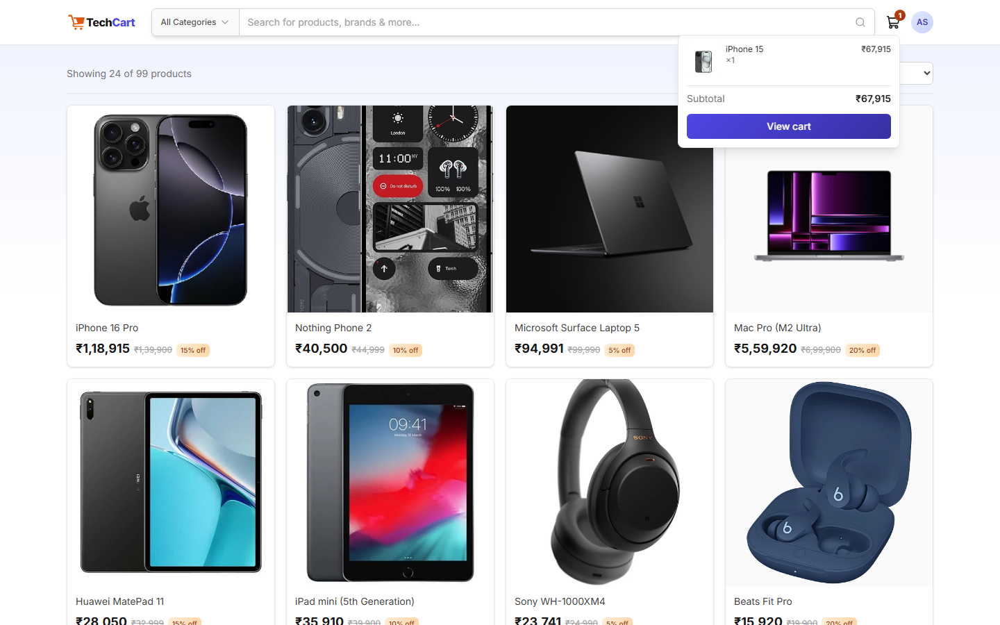

### The cart page

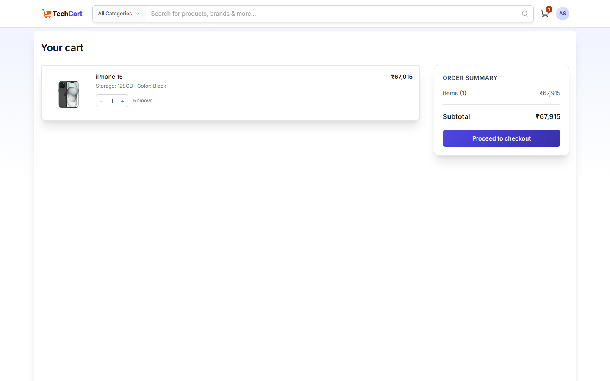

Each line shows the image, product name, the chosen variant attributes, a quantity
stepper (**−** / number / **+**, minimum 1, **maximum 10**), a **Remove** button, and
the line total.

- A line that is **no longer available** is dimmed and labelled _"No longer available
  — excluded from your total"_. It stays in the list but is left out of the subtotal.
- The **Order summary** shows **Items (n)** and the **Subtotal**, plus an
  _"n unavailable item(s) — excluded"_ line if any apply.
- **Proceed to checkout** is disabled while every line is unavailable, with the note
  _"Add an available item to check out."_

When the cart is empty you see _"Your cart is empty"_, a line _"Browse the catalogue
and add something you like."_, and a **Start shopping** button.

---

## 8. Checkout & payment

Checkout is a single page. You must be signed in and have at least one available
item.

### Shipping address

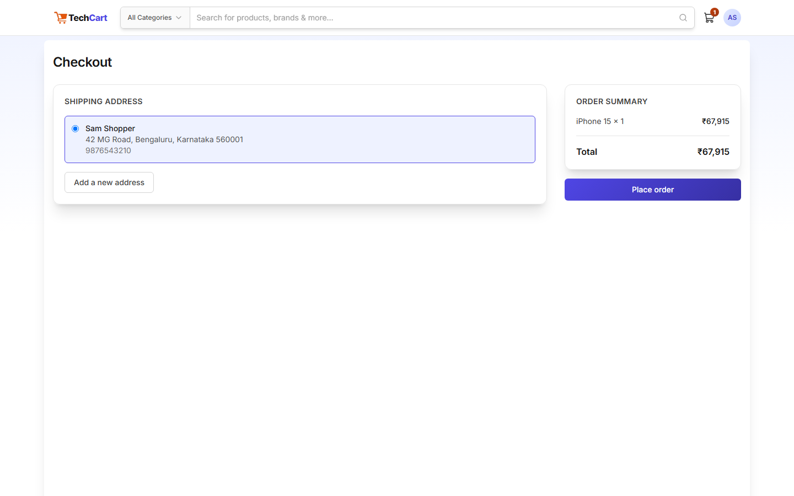

- **Shipping address** lists your saved addresses as radio options — full name, a
  **Default** pill where it applies, the address, and phone. Your default (or first)
  address is pre-selected.
- **Add a new address** opens an inline form; saving it selects that address.

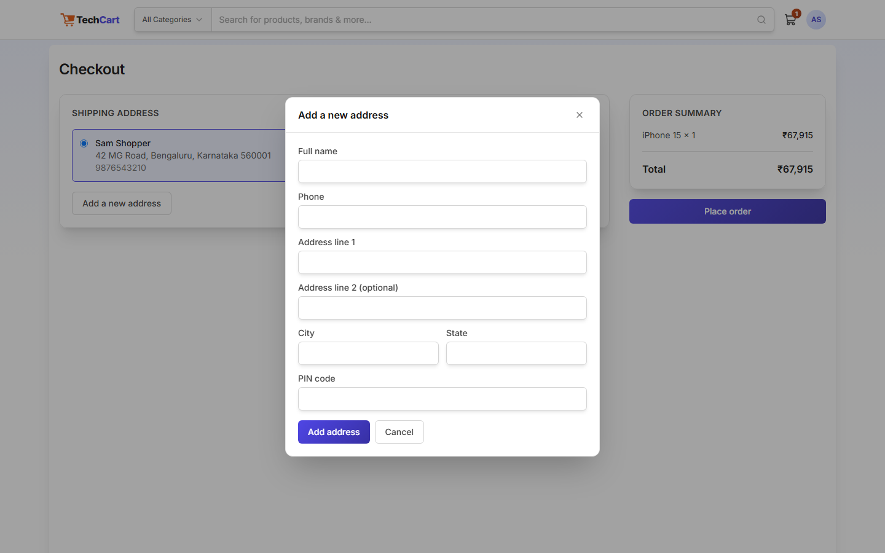

The **Order summary** on the right lists each available line as _name × qty_ with its
line total, then a bold **Total**.

Click **Place order** (it shows _"Placing order…"_). The button is disabled until an
address is selected.

> If any item became unavailable between your cart and this moment, a notice —
> _"Some items were removed from your order"_ — lists the affected SKUs. The rest of
> the order proceeds.

### Payment

After the order is placed, the payment step loads the **Razorpay Checkout** window.

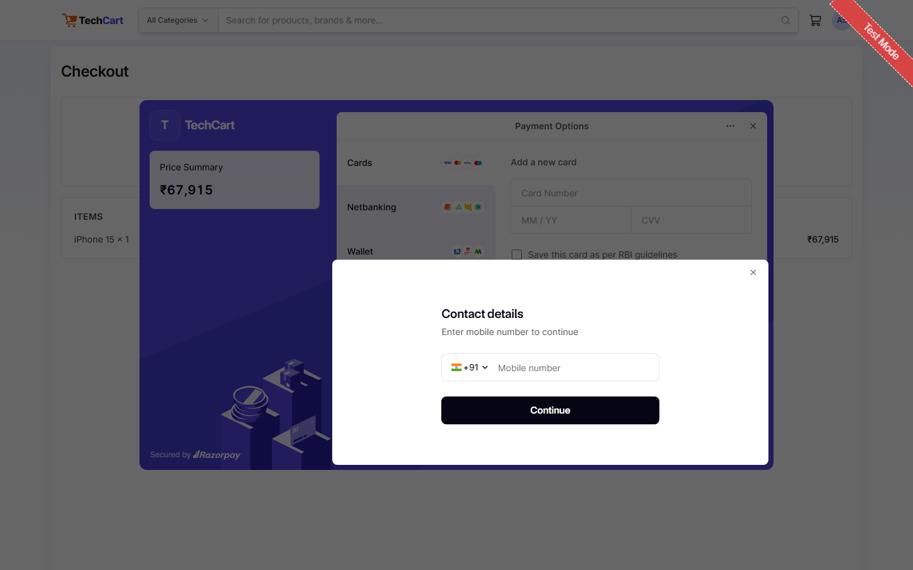

- The status text reads **"Opening secure payment…"**, then **"Confirming your
  payment…"** while it verifies.
- On success you are taken to the order's detail page.
- If the window is dismissed or a payment fails, you see an error and a **Retry
  payment** button. Retrying starts a fresh payment attempt.

Your order is created as soon as **Place order** succeeds — even if payment is not
completed, it appears under **Your orders** as **Pending payment**, and the ordered
items are removed from your cart. You can return and pay later, or cancel it.

The Razorpay Checkout card (card / UPI / net-banking options) is rendered by Razorpay
in a secure overlay; its exact contents depend on the payment methods enabled for the
merchant account.

---

## 9. Your orders

Open **Orders** from the account menu, or go to `/orders`.

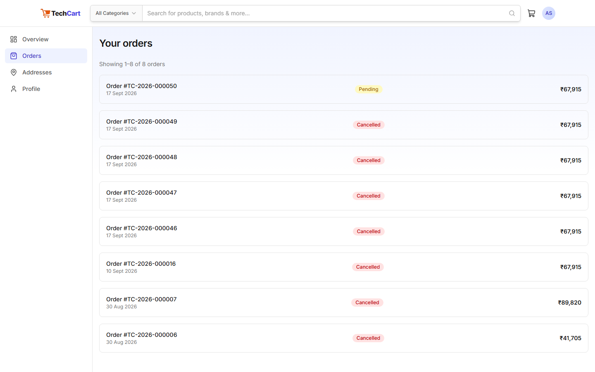

- The list shows one row per order: **Order #**, date, a status badge, and the total.
  The whole row links to the order.
- Long lists are paged with numbered buttons.
- With no orders yet you see _"No orders yet"_ and a **Start shopping** button.

### Order detail

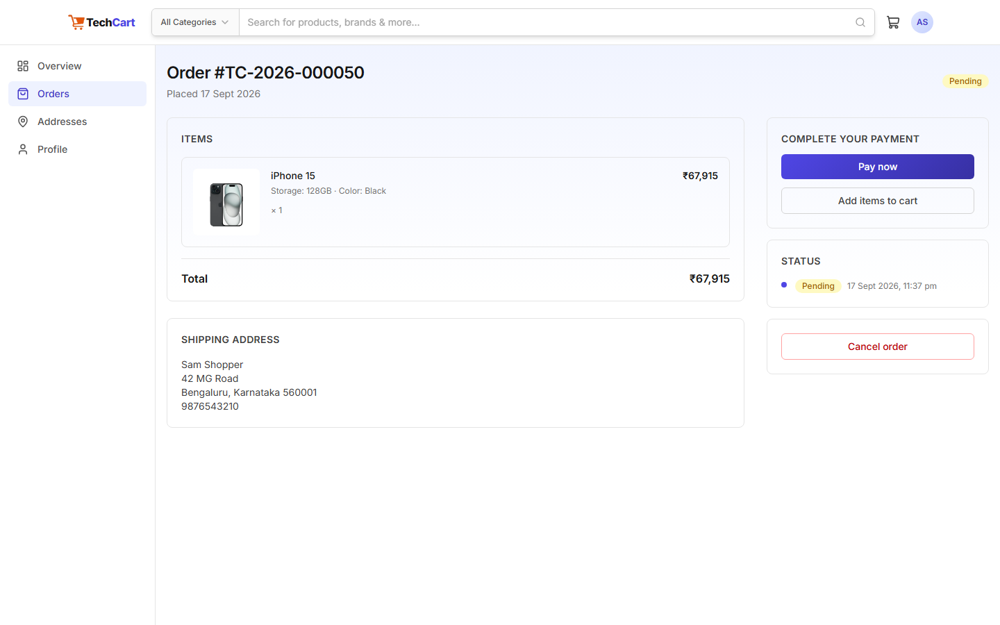

An order page shows:

- **Order #**, the date placed, and the current status badge.
- **Items** — each line as _name (attributes) × qty_ with its line total, then the
  **Total**.
- **Shipping address**.
- **Cancellation reason**, if the order was cancelled.
- **Status** — a timeline of every status change with its date, time, and any note.

### Cancelling

A **Cancel order** button appears only while the order is **Pending payment** or
**Paid**. Once cancelled it cannot be reopened.

### Status meanings

| Status              | Meaning                                  |
| ------------------- | ---------------------------------------- |
| **Pending payment** | Order placed, payment not yet completed. |
| **Paid**            | Payment received; awaiting processing.   |
| **Processing**      | Being prepared for dispatch.             |
| **Shipped**         | Handed to the carrier.                   |
| **Delivered**       | Received by you.                         |
| **Cancelled**       | Cancelled by you or by staff.            |
| **Refunded**        | Payment refunded.                        |

---

## 10. Your account

Open **Account** from the header menu, or go to `/account`. You must be signed in.

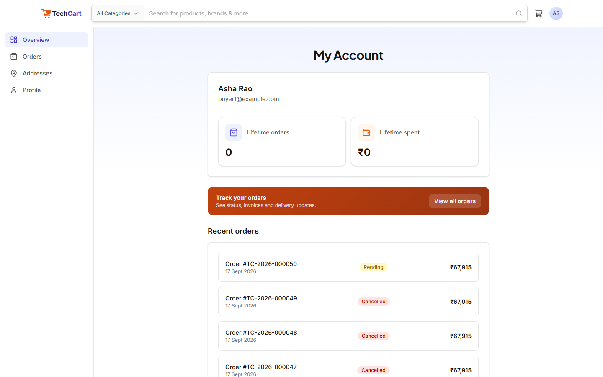

The account page has:

- **Account summary** — your name, email, and **Lifetime orders** / **Lifetime
  spent** totals.
- **Recent orders** — your five most recent orders, with a **View all orders** link.
  A brand-new account shows _"You haven't placed any orders yet."_
- **Edit profile** — see below.
- Links to **Manage saved addresses** and **View your orders**.

### Editing your profile

| Field             | Notes                                               |
| ----------------- | --------------------------------------------------- |
| **Email Address** | Read-only — shown for reference, cannot be changed. |
| **Name**          | Editable.                                           |
| **Phone**         | Editable.                                           |

Click **Save Changes**; a green _"Profile updated."_ confirms the change. Your name in
the header updates too.

---

## 11. Saved addresses

Open **Manage saved addresses** from the account page, or go to
`/account/addresses`.

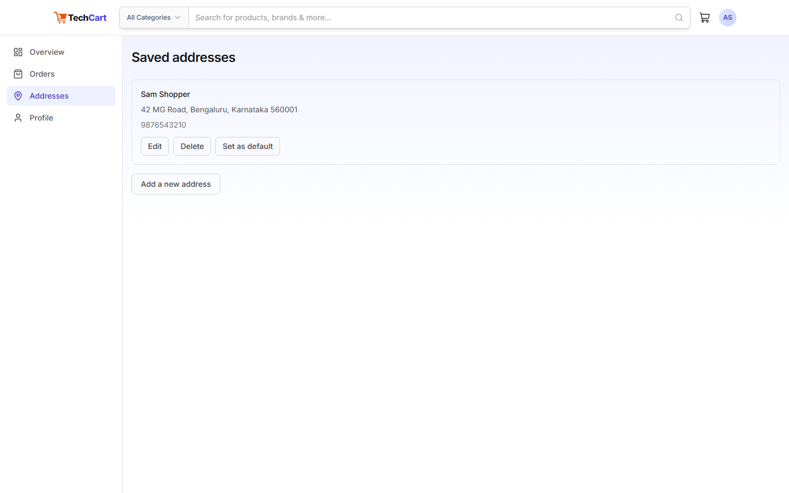

Each saved address shows the full name (with a **Default** pill where it applies), the
formatted address, and the phone number, plus:

- **Edit**
- **Delete**
- **Set as default** (only shown when it isn't already the default)

With no addresses yet you see _"No saved addresses yet"_ and an **Add an address**
button.

### The address form

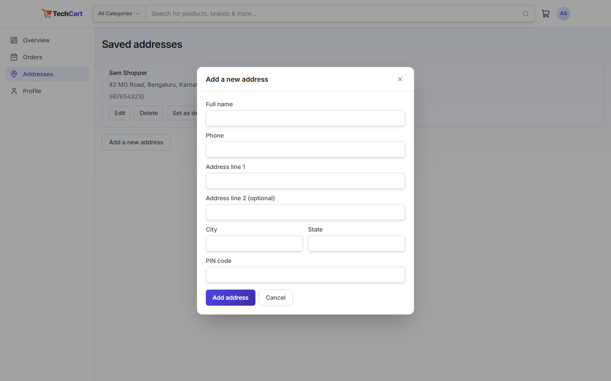

| Field                         | Required |
| ----------------------------- | -------- |
| **Full name**                 | Yes      |
| **Phone**                     | Yes      |
| **Address line 1**            | Yes      |
| **Address line 2 (optional)** | No       |
| **City**                      | Yes      |
| **State**                     | Yes      |
| **PIN code**                  | Yes      |

Submit with **Add address** (new) or **Save changes** (editing); **Cancel** discards.
The same form is used inline during checkout.

---

## 12. Header & navigation reference

| Element                     | What it does                                                                                                                                          |
| --------------------------- | ----------------------------------------------------------------------------------------------------------------------------------------------------- |
| **Logo**                    | Returns to the home page.                                                                                                                             |
| **All Categories**          | Dropdown of top-level categories; each opens its category page.                                                                                       |
| **Search box**              | _"Search for products, brands & more…"_ — suggestions after two characters; Enter opens the results page. On a phone, tap the magnifier to reveal it. |
| **Cart icon**               | Links to the cart. Shows a count badge once you have items and briefly shakes when the count goes up. Hover for the mini-cart.                        |
| **Profile icon / initials** | Signed out: links to sign-in. Signed in: opens a menu.                                                                                                |

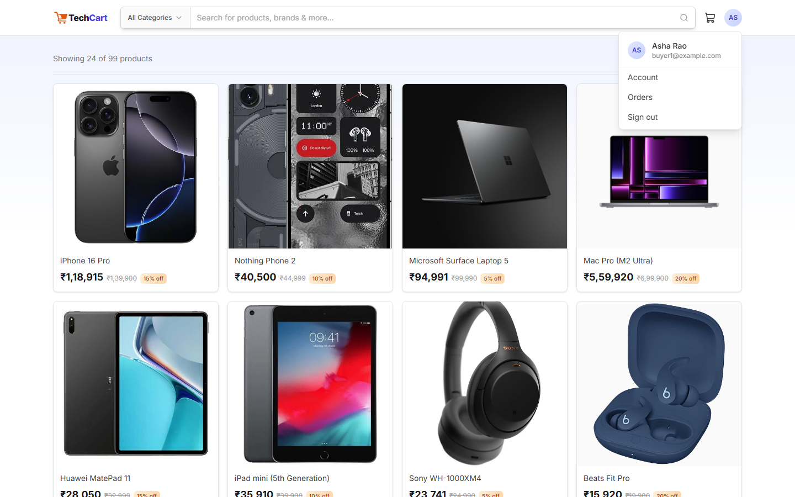

The profile menu (signed in) contains your name and email, then **Account**,
**Orders**, and **Sign out**.

The footer has quick links, customer-service links, social links, and the accepted
payment methods. Many footer links are placeholders on the current build.

---

## 13. Reference tables

### Order status

See [section 9](#status-meanings).

### Sign-in messages

| Message                                         | Fix                                |
| ----------------------------------------------- | ---------------------------------- |
| _The OTP you entered is invalid…_               | Re-type the 6-digit code.          |
| _The OTP has expired…_                          | Click **Resend OTP**.              |
| _This email is registered as an admin account…_ | Use a shopper email.               |
| _Failed to send OTP. Please try again._         | Check the email address and retry. |

### "Unable to reach the server"

The storefront talks to a backend that may be idle. The first request after a period
of inactivity can take several seconds while the server wakes up; a request that
takes too long shows _"Unable to reach the server."_ — wait a moment and retry the
action (most screens have a **Retry** button).
